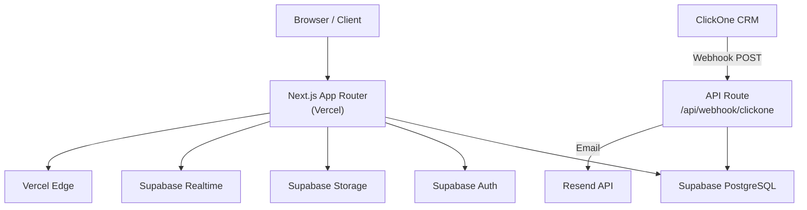

---
tags:
  - arquitetura
  - siding-depot
  - técnico
created: 2026-04-17
---

# ⚙️ Arquitetura Técnica

> Voltar para [[🏗️ Siding Depot — Home]]

---

## Stack Principal

| Tecnologia | Uso |
|------------|-----|
| **Next.js 14** | Framework full-stack (App Router) |
| **React 18** | UI Library |
| **TypeScript** | Linguagem principal |
| **Supabase** | PostgreSQL + Auth + Storage + Realtime |
| **Tailwind CSS** | Styling |
| **Vercel** | Hospedagem e deploy |

---

## Diagrama de Sistema

---

## Estrutura de Diretórios

| Caminho | Função |
|---------|--------|
| `app/(auth)/` | Login, Forgot/Reset Password → [[Autenticação e Controle de Acesso]] |
| `app/(shell)/` | Layout principal com Sidebar (Admin/Sales) |
| `app/customer/` | [[Customer Portal]] (layout separado) |
| `app/field/` | [[Field App]] para Crews |
| `app/api/` | Route Handlers ([[Webhook ClickOne]], [[Documentos e Contratos Digitais]]) |
| `components/` | Componentes compartilhados ([[Design System]]) |
| `lib/supabase.ts` | Cliente Supabase único |

---

## Rotas do Sistema

### `(shell)` — Admin/Staff Layout

| Rota | Módulo |
|------|--------|
| `/` | [[Dashboard]] |
| `/projects` | [[Projects]] |
| `/projects/[id]` | Detalhe do Projeto |
| `/new-project` | [[New Project]] |
| `/crews` | [[Crews e Partners]] |
| `/change-orders` | [[Change Orders]] |
| `/cash-payments` | [[Cash Payments]] |
| `/windows-tracker` | [[Windows e Doors Tracker]] |
| `/services` | [[Services e Warranty]] |
| `/schedule` | [[Job Schedule]] |
| `/sales-reports` | [[Sales Reports]] |
| `/settings` | [[Settings]] |

### `(auth)` — Autenticação

| Rota | Função |
|------|--------|
| `/login` | Tela de login |
| `/forgot-password` | Recuperação de senha |
| `/reset-password` | Redefinição com token |

### API Routes

| Rota | Função |
|------|--------|
| `POST /api/webhook/clickone` | [[Webhook ClickOne]] |
| `POST /api/documents/sign` | [[Documentos e Contratos Digitais]] |
| `POST /api/logout` | Logout |

---

## Relacionados
- [[Design System]]
- [[Banco de Dados]]
- [[Autenticação e Controle de Acesso]]
