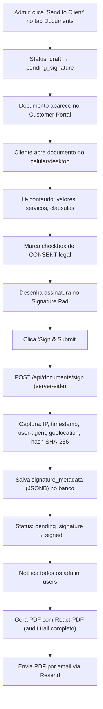
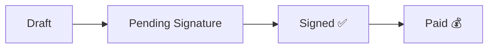

---
tags:
  - assinatura
  - compliance
  - legal
  - esign
  - siding-depot
created: 2026-04-18
---

# ✍️ Assinatura Digital e Compliance Legal (EUA)

> Voltar para [[🏗️ Siding Depot — Home]]

---

## Base Legal

| Lei | Escopo | Referência |
|-----|--------|------------|
| **ESIGN Act** (2000) | Federal — todo o território dos EUA | 15 U.S.C. § 7001 |
| **Georgia UETA** | Estadual — Georgia (sede da empresa) | O.C.G.A. § 10-12-1 et seq. |

Ambas as leis determinam que **assinatura eletrônica = assinatura manuscrita**, desde que sejam cumpridos os requisitos de evidência e consentimento.

---

## Requisitos Obrigatórios

| # | Dado | Descrição | Obrigatório |
|---|------|-----------|:-----------:|
| 1 | **IP Address** | Endereço IP do dispositivo do signatário | ✅ |
| 2 | **Timestamp (UTC)** | Data/hora exata da assinatura em UTC | ✅ |
| 3 | **User Agent** | Identifica dispositivo, sistema operacional e browser | ✅ |
| 4 | **Signer Identity** | Nome completo + email (via Supabase Auth) | ✅ |
| 5 | **Intent to Sign** | Ação deliberada — desenhar assinatura + clicar botão | ✅ |
| 6 | **Consent Clause** | Texto legal que o cliente aceita antes de assinar | ✅ |
| 7 | **Document Hash (SHA-256)** | Prova de integridade — documento não foi alterado após assinatura | ✅ |
| 8 | **Signature Image** | Imagem da assinatura em base64 (data URL do canvas) | ✅ |
| 9 | **Geolocation** (lat/lng) | Localização GPS do signatário (se autorizado) | ⚡ Recomendado |
| 10 | **Cópia PDF ao cliente** | Georgia exige que o cliente receba cópia do documento assinado | ✅ |

---

## Consent Clause (Texto Legal Obrigatório)

O seguinte texto deve ser exibido com um **checkbox obrigatório** antes do botão de assinatura:

> *"By signing below, I acknowledge that I have reviewed this document in its entirety. I understand that my electronic signature is legally binding and has the same legal effect as a handwritten signature under federal (ESIGN Act) and Georgia (UETA) law. I consent to conduct this transaction electronically."*

O cliente **precisa marcar o checkbox** antes de poder assinar. O timestamp de aceitação do consent é registrado separadamente.

---

## Estrutura de Dados — `signature_metadata` (JSONB)

Todos os dados de auditoria são armazenados em um campo `signature_metadata` do tipo `jsonb` nas tabelas `documents` e `completion_certificates`.

```json
{
  "signer_name": "Michael Thompson",
  "signer_email": "michael@email.com",
  "signer_profile_id": "uuid-do-profile",
  "ip_address": "73.215.44.102",
  "user_agent": "Mozilla/5.0 (iPhone; CPU iPhone OS 17_4...)",
  "geolocation": {
    "lat": 33.9519,
    "lng": -84.5499,
    "accuracy_meters": 12
  },
  "signed_at": "2026-04-18T22:30:00.000Z",
  "consent_text": "By signing below, I acknowledge that...",
  "consent_accepted_at": "2026-04-18T22:29:55.000Z",
  "document_hash_sha256": "a3f2c8e1...b91e04df",
  "signature_data_url": "data:image/png;base64,iVBOR...",
  "method": "canvas_touch_draw"
}
```

---

## Fluxo de Assinatura



---

## Captura de IP — Implementação

O IP do cliente é obtido via **Edge Function** ou **Route Handler** do Next.js, pois o IP não pode ser capturado pelo browser diretamente (segurança):

```typescript
// Exemplo: Route Handler Next.js
export async function POST(req: Request) {
  const ip = req.headers.get("x-forwarded-for")?.split(",")[0]
    || req.headers.get("x-real-ip")
    || "unknown";
  // ...
}
```

---

## Tipos de Documento

| Tipo | Quando é criado | Quantidade |
|------|----------------|:----------:|
| **Job Start Certificate** | Quando o projeto muda para `active` | **1 por projeto** |
| **Certificate of Completion (COC)** | Quando cada serviço é concluído | **1 por serviço** (Siding, Paint, Gutters, etc.) |

> **Regra de negócio (de [[1. Regras de Negócio e Domínio/Niveis_de_Acesso_Roles|Níveis de Acesso]]):**
> O instalador de Siding só interage com o COC de Siding; o instalador de Janelas só do de Janelas.
> **Acesso isolado por disciplina.**

---

## Status Pipeline dos Documentos



| Status | Significado |
|--------|-------------|
| `draft` | Documento criado, ainda não enviado ao cliente |
| `pending_signature` | Enviado e aguardando assinatura digital |
| `signed` | Assinado pelo cliente com auditoria completa |
| `paid` | Pagamento confirmado após assinatura |

---

## Tabelas no Banco de Dados

### `documents`
| Coluna | Tipo | Descrição |
|--------|------|-----------|
| `id` | uuid | PK |
| `job_id` | uuid | FK → jobs |
| `job_service_id` | uuid | FK → job_services (nullable) |
| `document_type` | enum | contract, completion_certificate, etc. |
| `status` | enum | draft, pending_signature, signed, paid |
| `title` | text | Nome do documento |
| `visible_to_customer` | boolean | Aparece no portal do cliente |
| `signature_metadata` | jsonb | **Dados de auditoria da assinatura** |

### `completion_certificates`
| Coluna | Tipo | Descrição |
|--------|------|-----------|
| `id` | uuid | PK |
| `job_id` | uuid | FK → jobs |
| `job_service_id` | uuid | FK → job_services (isolamento por disciplina) |
| `certificate_number` | text | Número único do certificado |
| `status` | enum | draft → pending_signature → signed → paid |
| `signature_metadata` | jsonb | **Dados de auditoria da assinatura** |

---

## Componente Existente

O componente `DynamicContractForm` já possui:
- Signature Pad (canvas touch/mouse)
- Line Items com valores por serviço
- Payment Method selector (Check / Financing / Credit Card)
- Customer Comments (COC only)
- Marketing Authorization com Initials (Job Start only)
- Read-only mode após assinatura
- Cláusulas legais de pagamento

**Status de implementação:**
- [x] Checkbox de consent legal obrigatório
- [x] Captura de IP via Route Handler (`/api/documents/sign`)
- [x] Captura de User Agent e Geolocation
- [x] Cálculo do document hash SHA-256
- [x] Armazenamento em `signature_metadata` (JSONB)
- [x] Geração de PDF e envio por email via Resend (`/api/documents/sign` → `lib/pdf` + `lib/email`)
- [x] Criação automática de documentos quando job é criado
- [x] Admin "Send to Client" (draft → pending_signature) no tab Documents
- [x] Notificação automática para admin quando cliente assina
- [x] RLS policies (customer SELECT + UPDATE, admin ALL, staff SELECT)
- [x] Página de assinatura no Customer Portal (`/customer/documents/[milestoneId]`)

---

## Riscos e Observações

> [!WARNING]
> **Nunca** armazene o IP diretamente no frontend. Use sempre um Route Handler ou Edge Function server-side para garantir autenticidade do dado.

> [!IMPORTANT]
> A Geolocation API do browser **requer permissão explícita** do usuário. Se negada, registrar `"geolocation": null` — a assinatura continua válida sem GPS (IP já basta para localização).

> [!CAUTION]
> Consultar advogado em Georgia para validar que os templates de contrato estão em conformidade com leis estaduais de home improvement e mechanics' liens.

---

## Relacionados
- [[Documentos e Contratos Digitais]]
- [[Customer Portal]]
- [[Autenticação e Controle de Acesso]]
- [[1. Regras de Negócio e Domínio/Niveis_de_Acesso_Roles|Níveis de Acesso]]
