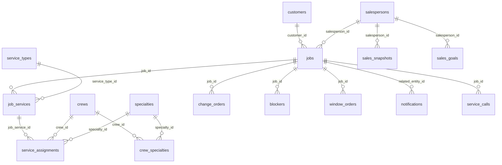

---
tags:
  - banco-de-dados
  - siding-depot
  - supabase
  - postgresql
  - schema
created: 2026-04-17
---

# 🗄️ Banco de Dados — Schema Supabase

> Voltar para [[🏗️ Siding Depot — Home]]

---

## Tabelas Principais

| Tabela | Descrição | Módulos relacionados |
|--------|-----------|---------------------|
| `customers` | Cadastro de clientes com portal credentials | [[Projects]], [[Webhook ClickOne]], [[Customer Portal]] |
| `jobs` | Projetos/orçamentos com pipeline de status | [[Projects]], [[Dashboard]] |
| `job_services` | Serviços vinculados a cada job | [[Projects]], [[New Project]] |
| `service_types` | Catálogo de tipos de serviço | [[New Project]] |
| `service_assignments` | Atribuição de crew a serviço com agenda | [[Projects]], [[Job Schedule]] |
| `crews` | Cadastro de equipes/parceiros | [[Crews e Partners]] |
| `crew_specialties` | Especialidades de cada crew | [[Crews e Partners]] |
| `specialties` | Catálogo de especialidades | [[Crews e Partners]] |
| `change_orders` | Ordens de alteração com pipeline de aprovação | [[Change Orders]] |
| `profiles` | Perfis de usuário (Auth linked) | [[Settings]], [[Autenticação e Controle de Acesso]] |
| `salespersons` | View/tabela de vendedores | [[Sales Reports]] |
| `sales_goals` | Metas de vendas por período | [[Sales Reports]] |
| `sales_snapshots` | Snapshots mensais de performance | [[Sales Reports]], [[Webhook ClickOne]] |
| `notifications` | Notificações do sistema (Realtime) | [[Notificações em Tempo Real]] |
| `service_calls` | Chamados de warranty/serviço | [[Services e Warranty]] |
| `blocker_attachments` | Mídia anexada a blockers/service calls | [[Services e Warranty]], [[Projects]] |
| `window_orders` | Pedidos de janelas/portas | [[Windows e Doors Tracker]] |
| `stores` | Lojas/fornecedores com cor | [[Cash Payments]], [[Windows e Doors Tracker]] |
| `blockers` | Issues/bloqueios de projetos | [[Projects]] |

---

## Diagrama de Relacionamentos (ER)

---

## Campos-Chave da Tabela `jobs`

| Campo | Tipo | Descrição |
|-------|------|-----------|
| `id` | uuid | PK |
| `customer_id` | FK → customers | Cliente |
| `salesperson_id` | FK → salespersons | Vendedor |
| `job_number` | text | Formato `SD-YYYY-XXXX` |
| `title` | text | Título do projeto |
| `status` | text | Pipeline status |
| `gate_status` | text | Bloqueio operacional |
| `contract_amount` | decimal | Valor do contrato |
| `contract_signed_at` | timestamp | Data de assinatura |
| `service_address_line_1` | text | Endereço |
| `city` | text | Cidade |
| `state` | text | Estado |
| `postal_code` | text | CEP |
| `description` | text | Notas internas |
| `start_date` | date | Data de início |
| `end_date` | date | Data de conclusão |

---

## Campos-Chave da Tabela `customers`

| Campo | Tipo | Descrição |
|-------|------|-----------|
| `id` | uuid | PK |
| `full_name` | text | Nome completo |
| `email` | text | Email |
| `phone` | text | Telefone |
| `address_line_1` | text | Endereço |
| `city` | text | Cidade |
| `state` | text | Estado |
| `postal_code` | text | CEP |
| `profile_id` | FK → auth.users | Vínculo portal |
| `username` | text | Username do portal |
| `portal_email` | text | Email gerado `@customer.sidingdepot.app` |

---

## Supabase Features Utilizadas

| Feature | Uso |
|---------|-----|
| **Auth** | Login, roles, customer portal |
| **Storage** | Avatars, attachments, change order files |
| **Realtime** | [[Notificações em Tempo Real]] (`notifications` table) |
| **RLS** | Row Level Security em tabelas sensíveis |
| **Triggers** | Geração automática de notificações |

---

## Relacionados
- [[Arquitetura Técnica]]
- Todos os módulos consomem este banco
