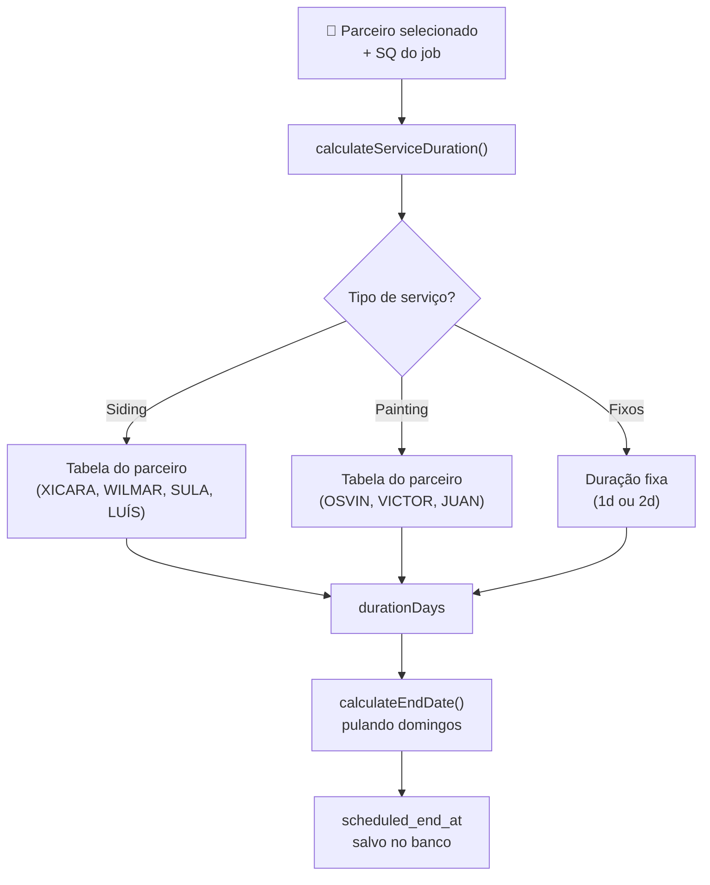

---
tags:
  - schedule
  - siding-depot
  - duração
  - calculadora
  - parceiros
  - crews
created: 2026-04-21
updated: 2026-04-21
---

# ⏱️ Calculador de Duração por Parceiro

> Voltar para [[🏗️ Siding Depot — Home]]
> Ver também: [[Job Schedule]] · [[Crews e Partners]]

**Arquivo:** `web/lib/duration-calculator.ts`

---

## Visão Geral

Sistema de cálculo automático de duração de serviços baseado em **produtividade real por parceiro (SQ/dia)**.

Substituiu as fórmulas genéricas anteriores (`SQ/8` para Siding, `SQ/10` para Paint) por tabelas individuais por crew.

### Integrado em 3 locais:

| Arquivo | Quando é usado |
|---------|----------------|
| `lib/duration-calculator.ts` | Módulo utilitário puro (fonte da verdade) |
| `app/(shell)/schedule/page.tsx` | Modal de rescheduling — recalcula `durationDays` ao salvar SQ |
| `app/(shell)/projects/[id]/page.tsx` | Ao adicionar novo serviço a um projeto existente |
| `app/(shell)/new-project/page.tsx` | Ao criar novo projeto com parceiros atribuídos |

---

## Regras de Calendário

| Dia | Status |
|-----|--------|
| Segunda a Sábado | ✅ Dia de trabalho |
| **Domingo** | ❌ Pula 100% (nunca conta) |

> [!IMPORTANT]
> **Sábado é dia útil.** Todos os cálculos de `end_date` e cascata de serviços respeitam essa regra.

---

## Tabelas de Siding

### XICARA (e XICARA 02)

Média: **10 SQ/dia**

| SQ | Dias |
|----|------|
| 1 – 13 | 1 dia |
| 14 – 17 | 2 dias |
| 18 – 20 | 3 dias |
| 21+ | `ceil(SQ ÷ 10)` |

> [!NOTE]
> XICARA 02 usa a mesma tabela que XICARA.

---

### WILMAR (e WILMAR 02)

Média: **6 SQ/dia**

| SQ | Dias |
|----|------|
| 1 – 8 | 1 dia |
| 9 – 12 | 2 dias |
| 13+ | `ceil(SQ ÷ 6)` |

**Exemplo:** 13 SQ → 13÷6 = 2.17 → `ceil` → **3 dias**

---

### SULA

Média: **10 SQ/dia (escala progressiva)**

| SQ | Dias |
|----|------|
| 1 – 11 | 1 dia |
| 12 – 15 | 2 dias |
| 16 – 26 | 3 dias |
| 27 – 36 | 4 dias |
| 37 – 40 | 5 dias |
| 41 – 55 | 6 dias |
| 56+ | `round(SQ ÷ 10)` |

**Arredondamento SULA:** `Math.round` (0.5 ou mais → sobe, abaixo de 0.5 → desce)

**Exemplos:**
- 64 SQ → 64÷10 = 6.4 → `round` → **6 dias**
- 65 SQ → 65÷10 = 6.5 → `round` → **7 dias** *(0.5+ sobe)*
- 74 SQ → 74÷10 = 7.4 → `round` → **7 dias**
- 75 SQ → 75÷10 = 7.5 → `round` → **8 dias**

---

### LUÍS

Média: **4.5 SQ/dia**

| SQ | Dias |
|----|------|
| 1 – 5 | 1 dia |
| 6 – 10 | 2 dias |
| 11 – 12 | 3 dias |
| 13 – 20 | 4 dias |
| 21 – 27 | 5 dias |
| 28+ | `round(SQ ÷ 4.5)` |

---

## Tabelas de Painting

### OSVIN (e OSVIN 02)

Média: **13 SQ/dia**

| SQ | Dias |
|----|------|
| 1 – 14 | 1 dia |
| 15 – 21 | 2 dias |
| 22 – 29 | 3 dias |
| 30 – 40 | 4 dias |
| 41+ | `ceil(SQ ÷ 13)` |

> [!NOTE]
> OSVIN 02 usa a mesma tabela que OSVIN.

---

### VICTOR

Média: **7.5 SQ/dia**

| SQ | Dias |
|----|------|
| 1 – 8 | 1 dia |
| 9 – 15 | 2 dias |
| 16 – 20 | 3 dias |
| 21+ | `round(SQ ÷ 7.5)` |

---

### JUAN

> Usa a **mesma tabela do VICTOR**.

---

## Serviços de Duração Fixa

Estes serviços **não dependem de SQ nem de parceiro**:

| Serviço | Duração Fixa |
|---------|-------------|
| **Gutters** | 1 dia |
| **Roofing** | 1 dia |
| **Decks** | 2 dias |
| **Doors** | 1 dia |
| **Windows** (unitário) | Calculado por contagem de janelas |

### Cálculo de Windows (por contagem)

```
Sem trim:  ceil(qtd_janelas ÷ 20)
Com trim:  ceil(qtd_janelas ÷ 12)
```

---

## SIDING DEPOT (a empresa)

Quando o parceiro é **Siding Depot** (a própria empresa sem crew específico):

| Serviço | Referência usada |
|---------|-----------------|
| Siding | Tabela do **XICARA** (mais produtivo) |
| Painting | Tabela do **OSVIN** (mais produtivo) |
| Fixos | Regras normais |

---

## Regras de Arredondamento

| Parceiro | Método | Comportamento |
|---------|--------|---------------|
| XICARA, WILMAR, OSVIN | `Math.ceil` | Sempre arredonda **para cima** |
| SULA, LUÍS, VICTOR, JUAN | `Math.round` | 0.5+ sobe · 0.4- desce |

---

## API Pública do Módulo

```typescript
import { calculateServiceDuration } from "@/lib/duration-calculator";
import { calculateEndDate } from "@/lib/duration-calculator";
```

### `calculateServiceDuration(partner, serviceType, sq)`

```typescript
/**
 * Retorna o número de dias úteis para completar o serviço.
 *
 * @param partner      - Nome do crew (ex: "XICARA", "Wilmar 02", "Siding Depot")
 * @param serviceType  - Tipo de serviço (ex: "siding", "painting", "gutters")
 * @param sq           - Square footage do job
 * @returns Número de dias úteis (mínimo 1)
 */
calculateServiceDuration(partner: string, serviceType: string, sq: number): number
```

**Exemplos:**
```typescript
calculateServiceDuration("XICARA", "siding", 15)    // → 2
calculateServiceDuration("WILMAR", "siding", 13)    // → 3 (ceil 2.17)
calculateServiceDuration("SULA", "siding", 64)      // → 6 (round 6.4)
calculateServiceDuration("OSVIN", "painting", 25)   // → 3
calculateServiceDuration("VICTOR", "painting", 9)   // → 2
calculateServiceDuration("LEANDRO", "gutters", 50)  // → 1 (fixo)
calculateServiceDuration("SERGIO", "decks", 20)     // → 2 (fixo)
```

---

### `calculateEndDate(startDateIso, durationDays)`

```typescript
/**
 * Calcula a data de fim a partir da data de início e duração,
 * pulando domingos. Sábado é dia útil.
 *
 * @param startDateIso - Data de início "YYYY-MM-DD"
 * @param durationDays - Número de dias úteis
 * @returns Data de fim "YYYY-MM-DD"
 */
calculateEndDate(startDateIso: string, durationDays: number): string
```

**Exemplos:**
```typescript
// Siding 3 dias começando Sexta
calculateEndDate("2026-04-24", 3)
// → "2026-04-28" (Sex + Sáb + pula Dom + Seg)

// Gutters 1 dia começando Sábado
calculateEndDate("2026-04-25", 1)
// → "2026-04-25" (mesmo dia)
```

---

## Como o Cálculo se Integra ao Fluxo



---

## Fluxo de Cascata (Ordem de Serviços)

Ao agendar o **Siding**, os demais serviços são automaticamente posicionados:

```
Siding (N dias)
    └─► Painting (começa no dia seguinte após Siding terminar)
            └─► Gutters (começa no dia seguinte após Paint terminar)
                    └─► Roofing (começa no dia seguinte após Gutters terminar)

Doors / Windows / Decks ─── Paralelo ao Siding (mesma data de início)
```

> [!TIP]
> A cascata preserva a duração individual de cada serviço — não recalcula ao arrastar no Gantt. O recálculo acontece apenas quando o SQ é alterado no modal de rescheduling.

---

## Histórico de Mudanças

### 2026-04-21 — Implementação inicial

| Ação | Detalhe |
|------|---------|
| **Criado** `lib/duration-calculator.ts` | Módulo utilitário com todas as tabelas |
| **Integrado** `schedule/page.tsx` | Substitui fórmulas genéricas no modal de rescheduling |
| **Integrado** `projects/[id]/page.tsx` | Substitui `calcDuration` genérico ao adicionar serviços |
| **Integrado** `new-project/page.tsx` | Usa parceiro selecionado no formulário para calcular duração |
| **TypeScript** `npx tsc --noEmit` | ✅ Zero erros de tipo |

---

## Relacionados

- [[Job Schedule]]
- [[Crews e Partners]]
- [[New Project]]
- [[Projects]]
