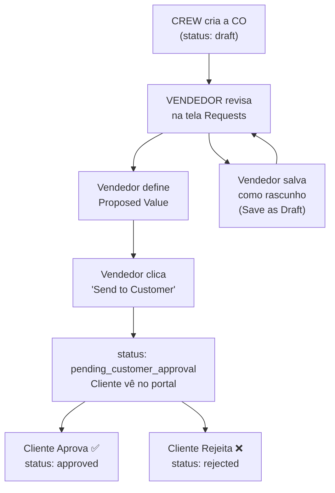
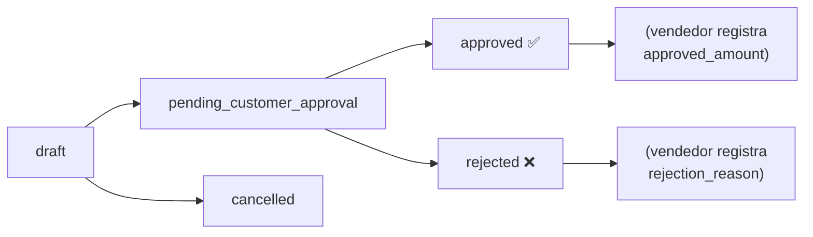

---
tags:
  - change-orders
  - siding-depot
  - financeiro
  - aprovação
  - vendor-mobile
created: 2026-04-17
updated: 2026-04-27
---

# 📝 Change Orders — Ordens de Alteração

> Voltar para [[🏗️ Siding Depot — Home]]

---

## Fluxo Completo (Crew → Vendedor → Cliente)



### Atores e Responsabilidades

| Ator | Ação | Tela |
|---|---|---|
| **Crew / Parceiro** | Cria a CO com itens e fotos | `/field/requests` (Field App) |
| **Vendedor** | Revisa, define valor, envia ao cliente | `/mobile/sales/requests` |
| **Cliente** | Aprova ou rejeita | Portal do Cliente |
| **Admin** | Visão geral, edição total | `/change-orders` |

---

## Pipeline de Status



### Significado de cada status

| Status | Significado | Quem pode ver |
|---|---|---|
| `draft` | Crew criou, vendedor ainda não enviou | Vendedor, Admin |
| `pending_customer_approval` | Vendedor enviou com valor proposto | Cliente, Vendedor, Admin |
| `approved` | Cliente aprovou | Todos |
| `rejected` | Cliente rejeitou | Todos |
| `cancelled` | Cancelada (sem ação) | Admin |

---

## Schema do Banco de Dados

### Tabela: `change_orders`

| Campo | Tipo | Descrição |
|---|---|---|
| `id` | uuid | PK |
| `job_id` | FK → `jobs` | Job relacionado |
| `job_service_id` | FK → `job_services` | Serviço específico |
| `title` | text | Título da CO |
| `description` | text | Descrição geral |
| `status` | enum | draft, pending_customer_approval, approved, rejected, cancelled |
| `requested_by_profile_id` | FK → `profiles` | Quem criou (geralmente o crew) |
| `proposed_amount` | numeric | Valor proposto pelo vendedor |
| `approved_amount` | numeric | Valor aprovado pelo cliente |
| `rejection_reason` | text | Motivo da rejeição |
| `requested_at` | timestamptz | Quando foi criada |
| `decided_at` | timestamptz | Quando cliente decidiu |
| `reviewed_by` | FK → `profiles` | Quem (vendedor) revisou |
| `reviewed_at` | timestamptz | Quando o vendedor revisou |

### Tabela: `change_order_items`

| Campo | Tipo | Descrição |
|---|---|---|
| `id` | uuid | PK |
| `change_order_id` | FK → `change_orders` | CO pai |
| `description` | text | Descrição do item |
| `amount` | numeric | Valor individual do item |
| `sort_order` | integer | Ordem de exibição |
| `created_at` | timestamptz | — |

### Tabela: `change_order_attachments`

| Campo | Tipo | Descrição |
|---|---|---|
| `id` | uuid | PK |
| `change_order_id` | FK → `change_orders` | CO pai |
| `change_order_item_id` | FK → `change_order_items` | Item específico (pode ser null) |
| `file_name` | text | Nome do arquivo |
| `url` | text | URL pública (Supabase Storage / R2) |
| `mime_type` | text | Tipo do arquivo |
| `size_bytes` | bigint | Tamanho |
| `uploaded_at` | timestamptz | — |

> **Importante:** `change_order_item_id` pode ser NULL — nesses casos o anexo pertence à CO como um todo (não a um item específico). Na UI, esses anexos aparecem na seção "Other Files".

---

## Foreign Keys Críticas (Supabase PostgREST)

> ⚠️ **Gotcha:** `change_orders` tem **duas FKs para `profiles`** (`requested_by_profile_id` e `reviewed_by`). Sem hints explícitos, o PostgREST aborta a query silenciosamente.

Sempre usar os hints corretos em queries:

```typescript
// ✅ CORRETO
supabase.from("change_orders").select(`
  requested_by_profile:profiles!change_orders_requested_by_profile_id_fkey (full_name),
  job_service:job_services!change_orders_job_service_id_fkey (
    service_type:service_types (name)
  )
`)

// ❌ ERRADO — falha silenciosamente
supabase.from("change_orders").select(`
  requested_by_profile:profiles (full_name),
  job_service:job_services (service_type:service_types (name))
`)
```

---

## RLS Policies

| Policy | Comando | Quem |
|---|---|---|
| `change_orders_admin_all` | ALL | `role = 'admin'` |
| `change_orders_salesperson_all` | ALL | Vendedor dos jobs da CO |
| `change_orders_partner_select` | SELECT | Crew que criou (`requested_by_profile_id = auth.uid()`) |
| `change_orders_partner_select_approved` | SELECT | Crew atribuído ao job, apenas COs aprovadas |
| `change_orders_customer_select` | SELECT | Cliente do job |
| `change_orders_customer_update` | UPDATE | Cliente do job (para aprovar/rejeitar) |
| `change_orders_partner_insert` | INSERT | Crews (para criar) |

---

## Telas por Perfil

### Admin — `/change-orders`
- Visão geral de todas as COs
- KPI strip (total pending, average CO, etc.)
- Filtros por status, data, busca livre
- Modal completo com edição total

### Vendedor Mobile — `/mobile/sales/requests`
- Lista apenas COs dos seus próprios jobs
- Popup com:
  - Itens numerados com fotos por item
  - Campo de Proposed Value
  - Botão **Send to Customer** → muda para `pending_customer_approval`
  - Botão **Save as Draft** → salva sem enviar
  - Se já aprovado: botão **Confirm Approval** + approved_amount
  - Se já rejeitado: botão **Confirm Rejection** + rejection_reason

### Field App — `/field/requests`
- Crew vê apenas as COs que ele mesmo criou
- Visualização somente (sem valores monetários — privacidade)
- Vê itens, fotos, status atual

### Portal do Cliente — `/customer/change-orders`
- Vê COs com status `pending_customer_approval`, `approved`, `rejected`
- Pode aprovar ou rejeitar

---

## Funcionalidades Gerais

| Feature | Detalhes |
|---|---|
| **Listagem Filtrada** | Tabs: ALL, PENDING, APPROVED, REJECTED |
| **Filtro por Data** | DatePicker customizado para range |
| **Busca** | Texto livre por título/cliente/job |
| **KPI Strip** | Total Pending Value, Average CO, etc. |
| **Modal/Popup de Detalhes** | Visualização completa + ações por perfil |
| **Itens Numerados** | Cada `change_order_item` aparece separado |
| **Fotos por Item** | Galeria vinculada ao item específico |
| **Upload de Arquivos** | Crews fazem upload via Field App |

---

## Integração com Outros Módulos

- Aparece no **detalhe do projeto** → [[Projects]]
- Gera **notificação** → [[Notificações em Tempo Real]]
- Visível no **portal do cliente** → [[Customer Portal]]
- Impacta **sales snapshots** → [[Sales Reports]]
- Criada pelo **Field App** → [[Field App]]

---

## Changelog

- **2026-04-27** — Fluxo completo Crew → Vendedor → Cliente implementado. Itens numerados com fotos por item no popup do vendedor. Fix crítico de FK hints no PostgREST. Ver [[Changelog 2026-04-27]].
- **2026-04-26** — Field App: restrição de CO por serviço (crew só cria CO do seu serviço). Ver [[Changelog 2026-04-26]].

---

## Relacionados
- [[Projects]]
- [[Customer Portal]]
- [[Sales Reports]]
- [[Field App]]
- [[Notificações em Tempo Real]]
- [[Banco de Dados]]
