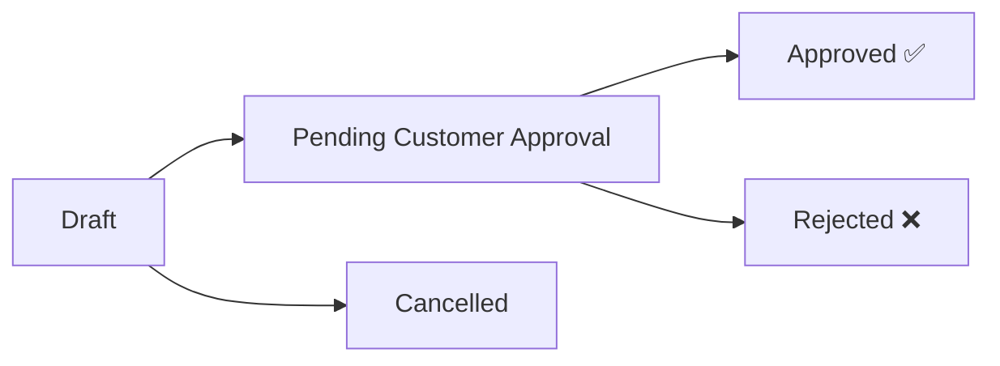

---
tags:
  - change-orders
  - siding-depot
  - financeiro
  - aprovação
created: 2026-04-17
---

# 📝 Change Orders — Ordens de Alteração

> Voltar para [[🏗️ Siding Depot — Home]]

**Rota:** `/change-orders`

---

## Pipeline de Aprovação

---

## Funcionalidades

| Feature | Detalhes |
|---------|----------|
| **Listagem Filtrada** | Tab filters: ALL, PENDING, APPROVED |
| **Filtro por Data** | DatePicker customizado para range |
| **Busca** | Texto livre por título/cliente |
| **KPI Strip** | Total Pending Value, Average CO, etc. |
| **Modal de Detalhes** | Visualização completa do CO com ações |
| **Upload de Arquivos** | Anexos via Supabase Storage |
| **Valores Monetários** | Proposed Amount vs. Approved Amount |

---

## Schema no [[Banco de Dados]]

| Campo | Tipo | Descrição |
|-------|------|-----------|
| `proposed_amount` | decimal | Valor proposto |
| `approved_amount` | decimal | Valor final aprovado |
| `job_id` | FK | → `jobs` ([[Projects]]) |
| `job_service_id` | FK | → `job_services` |
| `status` | enum | draft, pending, approved, rejected, cancelled |

---

## Integração com Outros Módulos

- Aparece no **detalhe do projeto** → [[Projects]]
- Gera **notificação** → [[Notificações em Tempo Real]]
- Visível no **portal do cliente** → [[Customer Portal]]
- Impacta **sales snapshots** → [[Sales Reports]]

---

## Relacionados
- [[Projects]]
- [[Customer Portal]]
- [[Sales Reports]]
- [[Notificações em Tempo Real]]
