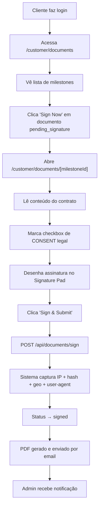

---
tags:
  - customer-portal
  - siding-depot
  - portal
  - cliente
  - assinatura
created: 2026-04-17
updated: 2026-04-19
---

# 🏠 Customer Portal — Portal do Cliente

> Voltar para [[🏗️ Siding Depot — Home]]

**Rota:** `/customer`

---

## Visão Geral

Layout dedicado sem Sidebar administrativa. Acesso restrito a usuários com `role = customer` → [[Autenticação e Controle de Acesso]].

Credenciais geradas automaticamente ao criar projeto — tanto via [[Webhook ClickOne]] quanto pelo [[New Project]] (admin). Detalhes em → [[Credenciais Customer Portal]].

---

## Módulos do Portal

| Rota | Funcionalidade | Arquivo |
|------|----------------|---------|
| `/customer` | Dashboard do cliente com overview do projeto | `app/customer/page.tsx` |
| `/customer/documents` | Listagem de documentos para assinatura | `app/customer/documents/page.tsx` |
| `/customer/documents/[milestoneId]` | Página de assinatura individual | `app/customer/documents/[milestoneId]/page.tsx` |
| `/customer/change-orders` | [[Change Orders]] para aprovação/rejeição | `app/customer/change-orders/page.tsx` |
| `/customer/colors` | Seleção de cores e materiais | `app/customer/colors/page.tsx` |

---

## Acesso

| Campo | Formato |
|-------|---------|
| **Username** | `FirstName_LastName` |
| **Password** | `FirstNameX*Year` |
| **Login** | `/login` → botão "CLIENTE" no Quick Access |

---

## Funcionalidades

### Dashboard
- Overview do projeto com status atual
- KPIs resumidos (serviços, progresso)
- Links rápidos para documentos pendentes

### Documentos e Assinatura Digital
- Lista todos os milestones (`project_payment_milestones`) do projeto
- Apenas documentos com status `pending_signature` aparecem com botão "Sign Now"
- Documentos `signed` mostram badge verde com data da assinatura
- Fluxo completo de assinatura → [[Documentos e Contratos Digitais]]
- Compliance legal → [[Assinatura Digital e Compliance]]

### Change Orders
- Visualização de Change Orders pendentes
- **Aprovação** ou **Rejeição** com motivo obrigatório
- Status visual: Pending → Approved / Rejected

### Cores e Materiais
- Seleção de cores para cada serviço
- Preview visual das opções

---

## Fluxo de Assinatura (Customer Side)

---

## Segurança

| Proteção | Implementação |
|----------|---------------|
| **Autenticação** | Supabase Auth (email/password) |
| **Autorização** | `role = customer` no profile |
| **RLS** | Customer só vê milestones do próprio job |
| **RLS Update** | Customer só pode mudar `pending_signature → signed` |
| **IP Capture** | Server-side via Route Handler (não manipulável) |
| **Audit Trail** | Todos os dados em `signature_metadata` (JSONB) |

---

## Relacionados
- [[Webhook ClickOne]]
- [[New Project]]
- [[Credenciais Customer Portal]]
- [[Autenticação e Controle de Acesso]]
- [[Change Orders]]
- [[Documentos e Contratos Digitais]]
- [[Assinatura Digital e Compliance]]
- [[Notificações em Tempo Real]]
