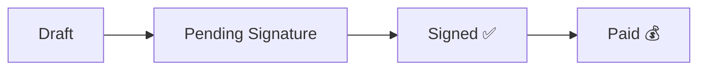
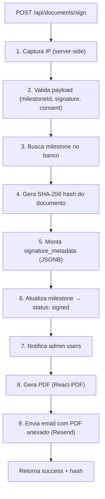

---
tags:
  - documentos
  - contratos
  - assinatura
  - pdf
  - email
  - compliance
  - siding-depot
created: 2026-04-17
updated: 2026-04-18
---

# ✍️ Documentos e Contratos Digitais

> Voltar para [[🏗️ Siding Depot — Home]]

---

## Componente: `DynamicContractForm`

Formulário dinâmico para geração e **assinatura digital** de certificados.

**Arquivo:** `components/DynamicContractForm.tsx`

---

## Tipos de Documento

| Tipo | Uso | Qtd por projeto |
|------|-----|:---------------:|
| **Job Start Certificate** | Assinado pelo cliente no início do projeto | **1** (valor total do contrato) |
| **Certificate of Completion (COC)** | Assinado na conclusão de cada serviço | **1 por serviço** (valor individual) |

> **Exemplo:** Um projeto com Siding ($12,000) + Painting ($3,000) gera:
> - 1x Job Start Certificate ($15,000)
> - 1x COC — Siding ($12,000)
> - 1x COC — Painting ($3,000)

---

## Auto-Geração de Milestones

Quando um novo projeto é criado via `/new-project`, o sistema **automaticamente** gera todos os milestones na tabela `project_payment_milestones`:

**Arquivo:** `app/(shell)/new-project/page.tsx` (linhas ~610-650)

```typescript
// 1. Job Start Certificate (valor total)
{ title: "Job Start Certificate", document_type: "job_start", amount: totalContractAmount }

// 2. COC por serviço (valor individual de cada service)
{ title: "Certificate of Completion — Siding", document_type: "completion_certificate", 
  amount: service.contracted_amount, job_service_id: service.id }
```

---

## Funcionalidades

| Feature | Detalhes |
|---------|----------|
| **Signature Pad** | Canvas para assinatura digital (mouse/touch) |
| **Initials** | Autorização de marketing (Job Start only) |
| **Customer Comments** | Textarea para itens pendentes (Completion only) |
| **Payment Method** | Seletor: Check, Financing, Credit Card |
| **Status Badges** | Draft → Pending Signature → Signed → Paid |
| **Line Items** | Breakdown dinâmico de valores por serviço |
| **Read-only mode** | Após assinatura, campos ficam bloqueados |
| **3% fee notice** | Aviso de taxa para cartão de crédito/débito |
| **Legal Consent** | Checkbox obrigatório com texto legal (ESIGN Act + Georgia UETA) |
| **Geolocation** | Captura GPS do signatário (se autorizado pelo browser) |

---

## Status Pipeline



---

## Admin Controls (Tab Documents)

No detalhe do projeto (`/projects/[id]`), tab **Documents**, o admin tem controle completo dos milestones:

| Ação | Status atual | O que faz |
|------|:------------:|-----------|
| **Send to Client** | `draft` | Muda para `pending_signature` → aparece no [[Customer Portal]] |
| **Copy Link** | `pending_signature` / `signed` | Copia URL de assinatura para enviar ao cliente |
| **Refresh** | Qualquer | Recarrega milestones do banco |

**Arquivo:** `app/(shell)/projects/[id]/page.tsx` (seção `activeTab === "documents"`)

---

## Informações no Documento

- **Contract Date** — Auto-preenchido
- **Homeowner Name** — Do cadastro do cliente
- **Address** — Do [[Projects|projeto]]
- **Sales Representative** — Vendedor atribuído
- **Progress Payment Schedule** — Tabela de valores por serviço
- **Contract Amount** — Total do contrato
- **Payment Method** — Check / Financing / Credit Card

---

## Cláusulas Legais

1. O valor acordado é devido na conclusão de cada etapa do projeto
2. O cronograma não inclui custos de serviço adicionais ([[Change Orders]])
3. Pagamentos são apenas para tarefas concluídas

---

## Header do Documento

```
SIDING DEPOT
2480 Sandy Plains Road · Office: 678-400-2004 · www.sidingdepot.com
Marietta, GA 30066 · office@sidingdepot.com
```

---

## API de Assinatura

**Rota:** `POST /api/documents/sign`
**Arquivo:** `app/api/documents/sign/route.ts`

### Fluxo completo da API:



### Campos capturados (audit trail):

| Campo | Origem |
|-------|--------|
| `ip_address` | `x-forwarded-for` / `x-real-ip` (server-side) |
| `user_agent` | Body do request |
| `geolocation` | Browser Geolocation API (opcional) |
| `signed_at` | Server timestamp (UTC ISO-8601) |
| `consent_text` | Texto legal completo aceito pelo cliente |
| `consent_accepted_at` | Timestamp de quando marcou o checkbox |
| `document_hash_sha256` | SHA-256 do conteúdo do documento |
| `signature_data_url` | Base64 da imagem da assinatura |
| `payment_method` | check / financing / credit_card |
| `method` | `canvas_touch_draw` |

Para detalhes legais, veja → [[Assinatura Digital e Compliance]]

---

## Geração de PDF

**Arquivo:** `lib/pdf/signed-document.tsx`

PDF profissional gerado com `@react-pdf/renderer` contendo:

- Header da empresa (Siding Depot)
- Dados do contrato (cliente, endereço, vendedor)
- Valor e método de pagamento
- Consent text aceito
- Imagem da assinatura
- **Audit trail completo** (IP, hash, geolocation, user-agent)
- Footer legal citando ESIGN Act e Georgia UETA

---

## Envio de Email

**Arquivo:** `lib/email/send-signed-document.ts`
**Serviço:** Resend (`RESEND_API_KEY` no `.env.local`)

Email HTML profissional enviado automaticamente ao cliente após assinatura, com:

- Template branded Siding Depot
- PDF do documento assinado em anexo
- Referência de contato da empresa
- Remetente: `no-reply@sidingdepot.com`

> Requisito legal da Georgia: o cliente deve receber cópia do documento assinado.

---

## Tabela no Banco: `project_payment_milestones`

| Coluna | Tipo | Descrição |
|--------|------|-----------|
| `id` | uuid | PK |
| `job_id` | uuid | FK → jobs |
| `job_service_id` | uuid | FK → job_services (nullable, só para COCs) |
| `title` | text | Nome do documento |
| `document_type` | enum | `job_start`, `completion_certificate` |
| `status` | enum | `draft`, `pending_signature`, `signed`, `paid` |
| `amount` | numeric | Valor do milestone |
| `sort_order` | int | Ordem de exibição |
| `signed_at` | timestamp | Data/hora da assinatura |
| `signature_data_url` | text | Base64 da imagem da assinatura |
| `payment_method` | text | `check`, `financing`, `credit_card` |
| `signature_metadata` | jsonb | **Audit trail completo** (IP, hash, geo, etc.) |
| `customer_notes` | text | Comentários do cliente (COC only) |
| `marketing_authorization_initials` | text | Iniciais de autorização (Job Start only) |

### RLS Policies

| Policy | Comando | Quem pode |
|--------|---------|-----------|
| Admin can manage milestones | ALL | `role = admin` |
| Staff can view all milestones | SELECT | `admin`, `salesperson`, `partner` |
| Customer can view own milestones | SELECT | Customer via `job → customer_id → profile_id` |
| Customer can sign their milestone | UPDATE | Customer (apenas `pending_signature` → `signed`) |

---

## Relacionados
- [[Assinatura Digital e Compliance]]
- [[Projects]]
- [[Customer Portal]]
- [[Change Orders]]
- [[Notificações em Tempo Real]]
