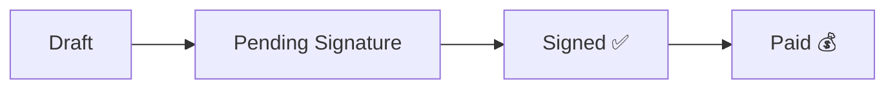

---
tags:
  - documentos
  - contratos
  - assinatura
  - siding-depot
created: 2026-04-17
---

# ✍️ Documentos e Contratos Digitais

> Voltar para [[🏗️ Siding Depot — Home]]

---

## Componente: `DynamicContractForm`

Formulário dinâmico para geração e **assinatura digital** de certificados.

---

## Tipos de Documento

| Tipo | Uso |
|------|-----|
| **Job Start Certificate** | Assinado pelo cliente no início do projeto |
| **Certificate of Completion** | Assinado na conclusão com comentários |

---

## Funcionalidades

| Feature | Detalhes |
|---------|----------|
| **Signature Pad** | Canvas para assinatura digital (mouse/touch) |
| **Initials** | Autorização de marketing (Job Start only) |
| **Customer Comments** | Textarea para itens pendentes (Completion only) |
| **Payment Method** | Seletor: Check, Financing, Credit Card |
| **Status Badges** | Draft → Pending Signature → Signed → Paid |
| **Line Items** | Breakdown dinâmico de valores por serviço |
| **Read-only mode** | Após assinatura, campos ficam bloqueados |
| **3% fee notice** | Aviso de taxa para cartão de crédito/débito |

---

## Status Pipeline



---

## Informações no Documento

- **Contract Date** — Auto-preenchido
- **Homeowner Name** — Do cadastro do cliente
- **Address** — Do [[Projects\|projeto]]
- **Sales Representative** — Vendedor atribuído
- **Progress Payment Schedule** — Tabela de valores por serviço
- **Contract Amount** — Total do contrato
- **Payment Method** — Check / Financing / Credit Card

---

## Cláusulas Legais

1. O valor acordado é devido na conclusão de cada etapa do projeto
2. O cronograma não inclui custos de serviço adicionais ([[Change Orders]])
3. Pagamentos são apenas para tarefas concluídas

---

## Header do Documento

```
SIDING DEPOT
2480 Sandy Plains Road · Office: 678-400-2004 · www.sidingdepot.com
Marietta, GA 30066 · office@sidingdepot.com
```

---

## API

`POST /api/documents/sign` — Processamento de assinaturas

---

## Relacionados
- [[Projects]]
- [[Customer Portal]]
- [[Change Orders]]
