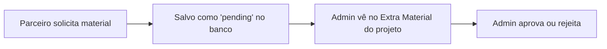

---
tags:
  - field-app
  - siding-depot
  - mobile
  - crews
  - portal-parceiro
  - extra-material
created: 2026-04-17
updated: 2026-04-22
---

# 📱 Field App — Portal de Campo (Parceiro/Crew)

> Voltar para [[🏗️ Siding Depot — Home]]

**Rota:** `/field`

---

## Visão Geral

Layout minimalista para uso em **dispositivos móveis** por [[Crews e Partners]] em campo.
Layout separado sem Sidebar administrativa.

---

## Módulos

| Rota | Funcionalidade |
|------|----------------|
| `/field` | Dashboard com contagem de jobs atribuídos |
| `/field/jobs` | My Jobs — projetos atribuídos ao parceiro logado |
| `/field/services` | Service Calls — para acompanhamento e report do Parceiro logado |
| `/field/requests` | My Requests — Acompanhar status dos Change Orders e Extra Materials enviados |

---

## My Jobs (Atualizado 22/04/2026)

O parceiro vê **apenas os projetos atribuídos a ele** via `service_assignments`:

| Informação | Fonte |
|------------|-------|
| Nome do cliente | `jobs → customers.full_name` |
| Endereço | `jobs.service_address_line_1, city, state, zip` |
| Serviços atribuídos | `job_services → service_types.name` |
| Data de início | `service_assignments.scheduled_start_at` |
| Data de término | `service_assignments.scheduled_end_at` |
| Valor do contrato | `jobs.contract_amount` |
| SQ | `jobs.sq` |

> A query usa RLS via `crews.profile_id` para garantir que cada parceiro vê apenas seus projetos.

---

## Solicitação de Material Extra (Novo 22/04/2026)

O parceiro pode solicitar material extra diretamente pelo portal:

### Campos da solicitação:

| Campo | Descrição | Obrigatório |
|-------|-----------|-------------|
| **Material Name** | Nome do material (ex: "J-Channel") | ✅ |
| **Quantity** | Quantidade de peças | ✅ |
| **Size** | Tamanho/dimensão da peça | ✅ |
| **Note** | Nota explicativa — uso, finalidade, localização | ✅ |

### Fluxo:

### Tabela: `extra_material_requests`

| Coluna | Tipo | Descrição |
|--------|------|-----------|
| `id` | uuid | PK |
| `job_id` | uuid | FK → jobs |
| `crew_id` | uuid | FK → crews |
| `material_name` | text | Nome do material |
| `quantity` | integer | Quantidade |
| `size` | text | Tamanho da peça |
| `note` | text | Justificativa/uso |
| `status` | text | `pending` / `approved` / `rejected` |
| `created_at` | timestamptz | Data da solicitação |

---

## Características

- **Mobile-first** — Otimizado para telas pequenas
- **Acesso restrito** — Somente usuários com `role = partner`
- **Jobs filtrados** — Mostra apenas jobs atribuídos ao crew logado (via RLS)
- **Quick actions** — Solicitar material extra
- **Dashboard real** — Contagem real de jobs atribuídos

---

## Relacionados
- [[Crews e Partners]]
- [[Projects]]
- [[Job Schedule]]
- [[Notificações em Tempo Real]]
