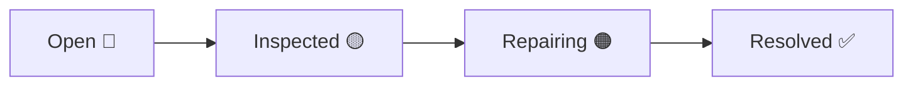

---
tags:
  - services
  - warranty
  - siding-depot
  - chamados
created: 2026-04-17
updated: 2026-04-19
---

# 🛠️ Services e Warranty — Chamados de Serviço

> Voltar para [[🏗️ Siding Depot — Home]]

**Rota:** `/services`

---

## Funcionalidades

| Feature | Detalhes |
|---------|----------|
| **Criação de Chamado** | Modal com título, descrição, tipo, disciplina |
| **Disciplinas** | Siding, Doors, Windows, Paint, Gutters, Roofing, Decks |
| **Status Pipeline** | `open` → `inspected` → `repairing` → `resolved` |
| **Inline Status Change** | Dropdown colorido na tabela |
| **Crew Assignment** | Atribuição de crew responsável → [[Crews e Partners]] |
| **Service Report Panel** | Painel lateral com detalhes completos |
| **Media Attachments** | Upload de fotos/vídeos via Supabase Storage (`blocker_attachments` bucket) |
| **Undo System** | Sistema global de desfazer ações |
| **Signal System** | Flag de alerta especial com acknowledge |
| **Delete** | Soft delete com confirmação |

---

## Tipos de Serviço Disponíveis (`service_types`)

| Nome | Código |
|------|--------|
| Siding | `siding` |
| Painting | `painting` |
| Windows | `windows` |
| Doors | `doors` |
| Roofing | `roofing` |
| Gutters | `gutters` |
| Decks | `decks` |

> [!NOTE]
> **Doors** adicionado em 2026-04-19 para suportar serviços de portas vindos da ClickOne.

---

## Pipeline de Status

---

## Componentes Dedicados

| Componente | Função |
|------------|--------|
| `NewServiceCallModal.tsx` | Modal de criação de novo chamado |
| `ServiceReportPanel.tsx` | Painel lateral de report com upload de mídia |

---

## Schema no [[Banco de Dados]]

| Tabela | Função |
|--------|--------|
| `service_types` | Tipos de serviço disponíveis (código + nome) |
| `service_calls` | Chamados de warranty/serviço |
| `blocker_attachments` | Mídia anexada |

---

## Relacionados
- [[Projects]]
- [[Crews e Partners]]
- [[Notificações em Tempo Real]]
- [[Webhook ClickOne]]
