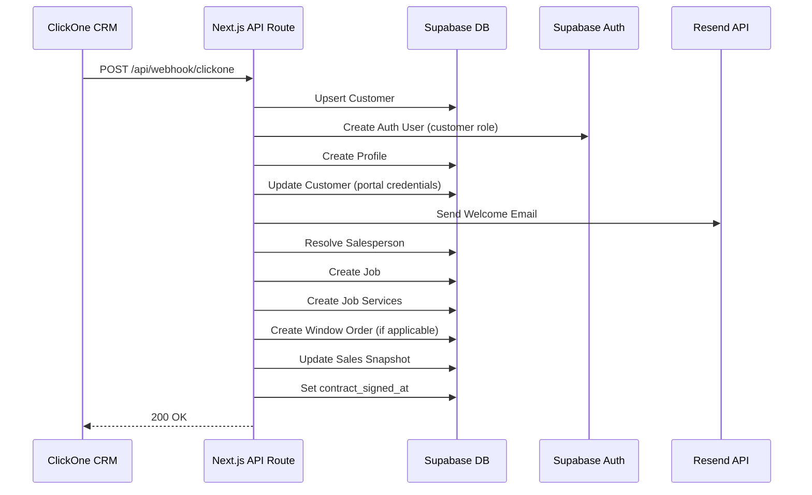

---
tags:
  - webhook
  - clickone
  - siding-depot
  - integração
  - crm
  - automação
created: 2026-04-17
updated: 2026-04-19
---

# 🔗 Webhook ClickOne — Integração CRM

> Voltar para [[🏗️ Siding Depot — Home]]

**Rota:** `POST /api/webhook/clickone`

---

## Fluxo Completo

---

## Payloads Suportados

| Campo ClickOne | Mapeamento |
|----------------|------------|
| `full_name` / `client_name` / `first_name + last_name` | → `customers.full_name` |
| `email` | → `customers.email` |
| `phone` | → `customers.phone` |
| `location.fullAddress` / `full_address` / `address` | → Parsing de City/State/ZIP |
| `Nome do Responsavel` / `salesperson` | → Resolução contra `salespersons` |
| `Preço final` / `value` | → `jobs.contract_amount` |
| `Serviço` / `Tipo de Serviço` / `service` | → `job_services` por matching |

---

## Customer Portal Auto-Generation

| Campo | Formato | Exemplo |
|-------|---------|---------|
| **Username** | `FirstName_LastName` | `Nick_Magalhaes` |
| **Password** | `FirstNameX*Year` | `NickM*2026` |
| **Portal Email** | `username@customer.sidingdepot.app` | `nick_magalhaes@customer.sidingdepot.app` |

→ Credenciais enviadas via **Welcome Email** (Resend API)
→ **Proteção contra duplicação:** Verifica `customers.profile_id` antes de criar — se já existir, pula a criação.
→ Veja: [[Customer Portal]] | [[Credenciais Customer Portal]]

---

## Automações Disparadas

| Automação | Módulo relacionado |
|-----------|-------------------|
| Criação de Customer | [[Banco de Dados]] |
| Criação de Auth User | [[Autenticação e Controle de Acesso]] |
| Criação de Job | [[Projects]] |
| Criação de Job Services | [[Projects]] |
| Criação de Window Order | [[Windows e Doors Tracker]] |
| Update Sales Snapshot | [[Sales Reports]] |
| Notificação | [[Notificações em Tempo Real]] |
| Welcome Email | [[Customer Portal]] |

---

## Tratamento de Erros

- Se auth user falhar → job continua (non-blocking)
- Se email falhar → job continua (non-blocking)
- Se job falhar → retorna HTTP 500 com mensagem de erro
- Se customer já tem `profile_id` → pula criação de portal (proteção contra duplicação)

---

## Relacionados
- [[Customer Portal]]
- [[Projects]]
- [[Sales Reports]]
- [[Windows e Doors Tracker]]
- [[Notificações em Tempo Real]]
