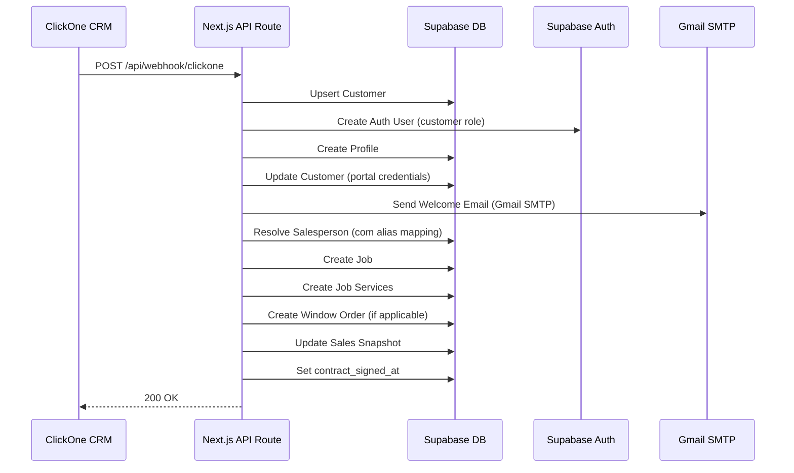

---
tags:
  - webhook
  - clickone
  - siding-depot
  - integração
  - crm
  - automação
created: 2026-04-17
updated: 2026-04-19
---

# 🔗 Webhook ClickOne — Integração CRM

> Voltar para [[🏗️ Siding Depot — Home]]

**Rota:** `POST /api/webhook/clickone`

---

## Fluxo Completo

---

## Payloads Suportados

Os campos podem vir no root do payload OU dentro de `customData`:

| Campo ClickOne | Mapeamento |
|----------------|------------|
| `full_name` / `client_name` / `first_name + last_name` | → `customers.full_name` |
| `email` | → `customers.email` |
| `phone` | → `customers.phone` |
| `Street_Address` (customData) | → `customers.address_line_1` |
| `City` (customData) | → `customers.city` |
| `State` (customData) | → `customers.state` |
| `Postal_Code` (customData) | → `customers.postal_code` |
| `Vendedor` (customData) | → Resolução contra `salespersons` via alias |
| `Valor` (customData) | → `jobs.contract_amount` |
| `Squares` (customData) | → `jobs.sq` |
| `Services` (root) | → `job_services` por matching de nome |

> [!NOTE]
> O ClickOne envia campos personalizados dentro do objeto `customData`. O webhook extrai de ambos os locais (root e customData) com fallback.

---

## Mapeamento de Vendedores (Alias)

O webhook usa um mapa de aliases para resolver nomes do CRM para nomes internos do sistema:

| Nome no ClickOne | Nome no Sistema | Código |
|------------------|-----------------|--------|
| Matheus Araujo | Matt | M |
| Armando Magalhaes | Armando | A |

> A resolução é feita via normalização (lowercase + trim) e busca por alias antes do fallback por `ilike`.

---

## Customer Portal Auto-Generation

| Campo | Formato | Exemplo |
|-------|---------|---------
| **Username** | `FirstName_LastName` | `Nick_Magalhaes` |
| **Password** | `FirstNameX*Year` | `NickM*2026` |
| **Portal Email** | `username@customer.sidingdepot.app` | `nick_magalhaes@customer.sidingdepot.app` |

→ Credenciais enviadas via **Welcome Email** (Gmail SMTP / Nodemailer)
→ **Proteção contra duplicação:** Verifica `customers.profile_id` antes de criar — se já existir, pula a criação.
→ Veja: [[Customer Portal]] | [[Credenciais Customer Portal]]

---

## Envio de Email (Gmail SMTP)

| Configuração | Variável de Ambiente |
|-------------|---------------------|
| **Email de envio** | `GMAIL_USER` |
| **Senha de app** | `GMAIL_APP_PASSWORD` |

- Biblioteca: `nodemailer` com `service: 'gmail'`
- O email contém: nome do cliente, username, password e botão "Access Your Portal"
- Mensagem: *"Your project with Siding Depot has been successfully closed."*
- Se o envio falhar, o job é criado normalmente (non-blocking)

> [!WARNING]
> O Gmail tem limite de **500 emails/dia** (conta pessoal). Para escala, considerar migrar para domínio próprio via Resend.

---

## Serviços Disponíveis

| Serviço | Código |
|---------|--------|
| Siding | `siding` |
| Painting | `painting` |
| Windows | `windows` |
| Doors | `doors` |
| Roofing | `roofing` |
| Gutters | `gutters` |
| Decks | `decks` |

> O campo `Services` do webhook aceita múltiplos serviços separados por vírgula (ex: `"Doors, Windows"`). Cada serviço é mapeado por nome (case-insensitive) contra `service_types`.

---

## Automações Disparadas

| Automação | Módulo relacionado |
|-----------|-------------------|
| Criação de Customer | [[Banco de Dados]] |
| Criação de Auth User | [[Autenticação e Controle de Acesso]] |
| Criação de Job | [[Projects]] |
| Criação de Job Services | [[Projects]] |
| Criação de Window Order | [[Windows e Doors Tracker]] |
| Update Sales Snapshot | [[Sales Reports]] |
| Notificação | [[Notificações em Tempo Real]] |
| Welcome Email (Gmail) | [[Customer Portal]] |

---

## Tratamento de Erros

- Se auth user falhar → job continua (non-blocking)
- Se email falhar → job continua (non-blocking)
- Se job falhar → retorna HTTP 500 com mensagem de erro
- Se customer já tem `profile_id` → pula criação de portal (proteção contra duplicação)

---

## Endpoint de Teste de Email

**Rota:** `GET /api/test-email`

Endpoint temporário para validar se o Gmail SMTP está configurado corretamente. Envia um email de teste para `bionej20@gmail.com` e retorna o resultado.

---

## Relacionados
- [[Customer Portal]]
- [[Credenciais Customer Portal]]
- [[Projects]]
- [[Sales Reports]]
- [[Windows e Doors Tracker]]
- [[Notificações em Tempo Real]]
