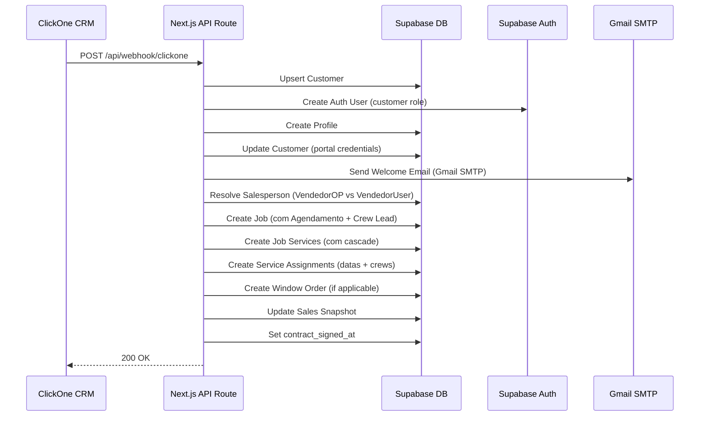
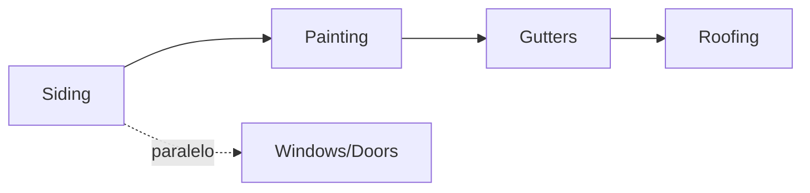

---
tags:
  - webhook
  - clickone
  - siding-depot
  - integração
  - crm
  - automação
created: 2026-04-17
updated: 2026-04-20
---

# 🔗 Webhook ClickOne — Integração CRM

> Voltar para [[🏗️ Siding Depot — Home]]

**Rota:** `POST /api/webhook/clickone`

---

## Fluxo Completo

---

## Payloads Suportados

Os campos podem vir no root do payload OU dentro de `customData`:

| Campo ClickOne | Variável Workflow | Mapeamento |
|----------------|-------------------|------------|
| `full_name` / `first_name + last_name` | — | → `customers.full_name` |
| `email` | — | → `customers.email` |
| `phone` | — | → `customers.phone` |
| `Street_Address` (customData) | `{{contact.street_address}}` | → `customers.address_line_1` |
| `City` (customData) | `{{contact.city}}` | → `customers.city` |
| `State` (customData) | `{{contact.state}}` | → `customers.state` |
| `Postal_Code` (customData) | `{{contact.postal_code}}` | → `customers.postal_code` |
| `VendedorOP` (customData) | `{{opportunity.assignedToUsersName}}` | → Vendedor (opção 1) |
| `VendedorUser` (customData) | `{{user.name}}` | → Vendedor (opção 2) |
| `Valor` (customData) | `{{opportunity.lead_value}}` | → `jobs.contract_amount` |
| `Squares` (customData) | `{{opportunity.squares}}` | → `jobs.sq` |
| `Agendamento` (customData) | `{{appointment.only_start_date}}` | → `jobs.requested_start_date` |
| `Services` (root) | — | → `job_services` + cascade |
| `Crew Lead` (root) | — | → `service_assignments.crew_id` |

> [!NOTE]
> O ClickOne envia campos personalizados dentro do objeto `customData`. O webhook extrai de ambos os locais (root e customData) com fallbacks múltiplos.

---

## Lógica de Vendedor (VendedorOP vs VendedorUser)

O webhook recebe **duas variáveis** que podem conter o nome do vendedor:

| Variável | Origem | Descrição |
|----------|--------|-----------|
| `VendedorOP` | `{{opportunity.assignedToUsersName}}` | Usuário atribuído à oportunidade |
| `VendedorUser` | `{{user.name}}` | Usuário que disparou o workflow |

### Regras de resolução:

| VendedorOP | VendedorUser | Resultado |
|------------|-------------|-----------|
| `"Matheus Araujo"` | `"Matheus Araujo"` | ✅ **Matheus Araujo** (iguais) |
| `"Matheus Araujo"` | `""` (vazio) | ✅ **Matheus Araujo** (só 1 preenchido) |
| `""` (vazio) | `"Matheus Araujo"` | ✅ **Matheus Araujo** (só 1 preenchido) |
| `"Matheus Araujo"` | `"Ruby Davenport"` | ❌ **Nenhum** (nomes diferentes) |
| `""` | `""` | Fallback legado: `cd.Vendedor`, `payload.owner` |

### Mapeamento de Aliases:

| Nome no ClickOne | Nome no Sistema |
|------------------|-----------------|
| Matheus Araujo | Matt |
| Armando Magalhaes | Armando |
| Ruby Davenport | Ruby |

> A resolução é feita via normalização (lowercase + trim) e busca por alias antes do fallback por `ilike`.

---

## Agendamento (Data de Início)

O campo `customData.Agendamento` define a **data de início** do projeto:

| Campo | Formato esperado | Exemplo |
|-------|-----------------|---------|
| `Agendamento` | Texto em inglês | `"April 22, 2026"` |
| `Agendamento` | ISO | `"2026-04-22"` |

### Fallback chain:
1. `customData.Agendamento` ← principal
2. `Close Date` (root do payload)
3. **Data de hoje** (último recurso)

→ Salvo em `jobs.requested_start_date`
→ Usado como data base para toda a **cascata de serviços**

---

## Crew Lead (Parceiro Responsável)

O campo `Crew Lead` define o **parceiro principal** que vai executar o serviço:

| Campo | Exemplo | Comportamento |
|-------|---------|---------------|
| `Crew Lead` | `"Xicara"` | Busca crew no banco (case-insensitive) |

### Resolução por Especialidade:

O sistema busca as **especialidades da crew** via tabela `crew_specialties` e atribui ao serviço correspondente:

| Crew Lead | Especialidades (do banco) | Atribuído a |
|-----------|---------------------------|-------------|
| `Xicara` | Siding Installation | Siding |
| `Osvin` | Painting | Painting |
| `Sergio` | Windows, Doors | Windows + Doors |
| `Leandro` | Gutters | Gutters |
| `Josue` | Roofing | Roofing |

**Serviços que o Crew Lead não cobre → usam crew default:**

| Serviço | Default Crew |
|---------|-------------|
| Siding | XICARA |
| Painting | OSVIN |
| Windows | SERGIO |
| Doors | SERGIO |
| Gutters | LEANDRO |
| Roofing | JOSUE |

> **Exemplo:** `Crew Lead = "Osvin"` + `Services = "Siding, Paint"`
> → Painting = **OSVIN** (crew lead), Siding = **XICARA** (default)

---

## Cascata de Agendamento

Quando o webhook cria serviços, as datas são calculadas automaticamente usando a mesma lógica do `New Project`:

### Duração por SQ (Square Footage):

| Serviço | Fórmula | Exemplo (18 SQ) |
|---------|---------|------------------|
| Siding | `ceil(SQ / 8)` | 3 dias |
| Painting | `ceil(SQ / 10)` | 2 dias |
| Windows/Doors | 1 dia fixo | 1 dia |
| Gutters | 1 dia fixo | 1 dia |
| Roofing | 1 dia fixo | 1 dia |

### Cadeia de Dependências:

| Serviço | Predecessores | Início |
|---------|--------------|--------|
| Siding | — | Data do Agendamento |
| Windows/Doors | — (paralelo) | Data do Agendamento |
| Painting | Siding | Dia após fim do Siding |
| Gutters | Painting → Siding | Dia após fim do Painting |
| Roofing | Gutters → Painting → Siding | Dia após fim do Gutters |

### Regras de negócio automáticas:

- Se tem **Siding** sem **Painting** → Painting é adicionado automaticamente
- Se tem **Gutters** sem **Roofing** → Roofing é adicionado automaticamente
- **Domingos** são pulados (dia de folga)
- Cria `service_assignments` com status `scheduled` e datas calculadas

### Exemplo concreto (18 SQ, início 22/04):

| Serviço | Início | Duração | Fim | Crew |
|---------|--------|---------|-----|------|
| Siding | 22/04 (Qua) | 3 dias | 24/04 (Sex) | XICARA |
| Windows | 22/04 (Qua) | 1 dia | 22/04 (Qua) | SERGIO |
| Painting | 25/04 (Sáb) | 2 dias | 27/04 (Seg) | OSVIN |

---

## Customer Portal Auto-Generation

| Campo | Formato | Exemplo |
|-------|---------|---------
| **Username** | `FirstName_LastName` | `Nick_Magalhaes` |
| **Password** | `FirstNameX*Year` | `NickM*2026` |
| **Portal Email** | `username@customer.sidingdepot.app` | `nick_magalhaes@customer.sidingdepot.app` |

→ Credenciais enviadas via **Welcome Email** (Gmail SMTP / Nodemailer)
→ **Proteção contra duplicação:** Verifica `customers.profile_id` antes de criar — se já existir, pula a criação.
→ Veja: [[Customer Portal]] | [[Credenciais Customer Portal]]

---

## Envio de Email (Gmail SMTP)

| Configuração | Variável de Ambiente |
|-------------|---------------------|
| **Email de envio** | `GMAIL_USER` |
| **Senha de app** | `GMAIL_APP_PASSWORD` |

- Biblioteca: `nodemailer` com `service: 'gmail'`
- O email contém: nome do cliente, username, password e botão "Access Your Portal"
- Mensagem: *"Your project with Siding Depot has been successfully closed."*
- Se o envio falhar, o job é criado normalmente (non-blocking)

> [!WARNING]
> O Gmail tem limite de **500 emails/dia** (conta pessoal). Para escala, considerar migrar para domínio próprio via Resend.

---

## Serviços Disponíveis

| Serviço | Código | Specialty Code |
|---------|--------|----------------|
| Siding | `siding` | `siding_installation` |
| Painting | `painting` | `painting` |
| Windows | `windows` | `windows` |
| Doors | `doors` | `doors` |
| Roofing | `roofing` | `roofing` |
| Gutters | `gutters` | `gutters` |
| Decks | `decks` | `deck_building` |

> O campo `Services` do webhook aceita múltiplos serviços separados por vírgula (ex: `"Siding, Paint, Windows"`). Cada serviço é normalizado por código e mapeado contra `service_types`.

---

## Automações Disparadas

| Automação | Módulo relacionado |
|-----------|-------------------|
| Criação de Customer | [[Banco de Dados]] |
| Criação de Auth User | [[Autenticação e Controle de Acesso]] |
| Criação de Job | [[Projects]] |
| Criação de Job Services | [[Projects]] |
| **Criação de Service Assignments (cascade)** | [[Job Schedule]] |
| Criação de Window Order | [[Windows e Doors Tracker]] |
| Update Sales Snapshot | [[Sales Reports]] |
| Welcome Email (Gmail) | [[Customer Portal]] |

---

## Tratamento de Erros

- Se auth user falhar → job continua (non-blocking)
- Se email falhar → job continua (non-blocking)
- Se job falhar → retorna HTTP 500 com mensagem de erro
- Se customer já tem `profile_id` → pula criação de portal (proteção contra duplicação)
- Se `service_type` não encontrado → pula serviço e loga warning
- Se `Crew Lead` não encontrado → usa crews default

---

## Endpoint de Teste de Email

**Rota:** `GET /api/test-email`

Endpoint temporário para validar se o Gmail SMTP está configurado corretamente. Envia um email de teste para `bionej20@gmail.com` e retorna o resultado.

---

## Relacionados
- [[Customer Portal]]
- [[Credenciais Customer Portal]]
- [[Projects]]
- [[Sales Reports]]
- [[Windows e Doors Tracker]]
- [[Job Schedule]]
- [[Crews e Partners]]
- [[New Project]]
