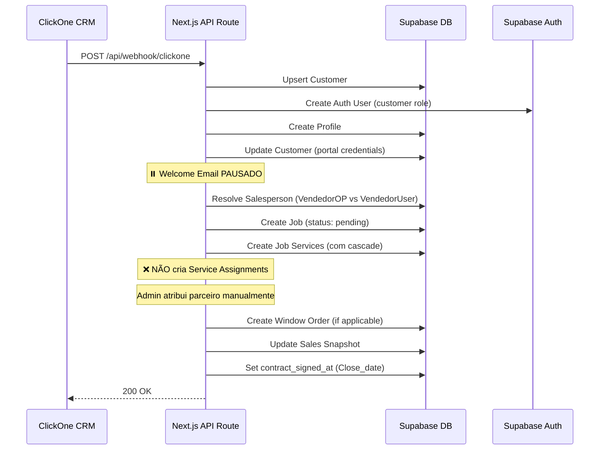
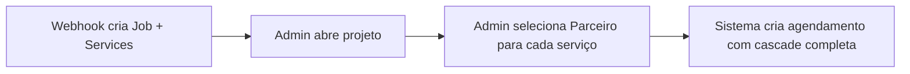
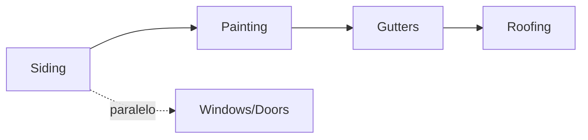

---
tags:
  - webhook
  - clickone
  - siding-depot
  - integração
  - crm
  - automação
created: 2026-04-17
updated: 2026-04-22
---

# 🔗 Webhook ClickOne — Integração CRM

> Voltar para [[🏗️ Siding Depot — Home]]

**Rota:** `POST /api/webhook/clickone`

---

## Fluxo Completo (Atualizado 22/04)

> [!IMPORTANT]
> **Mudança crítica (22/04/2026):** O webhook **NÃO cria mais `service_assignments` automaticamente**. O admin (Nick) atribui parceiros manualmente via interface do projeto. Quando o admin seleciona um parceiro, o sistema cria o agendamento com toda a lógica de cascade, SQ, duração, etc.

---

## Payloads Suportados

Os campos podem vir no root do payload OU dentro de `customData`:

| Campo ClickOne | Variável Workflow | Mapeamento |
|----------------|-------------------|------------|
| `full_name` / `first_name + last_name` | — | → `customers.full_name` |
| `email` | — | → `customers.email` |
| `phone` | — | → `customers.phone` |
| `Street_Address` (customData) | `{{contact.street_address}}` | → `customers.address_line_1` |
| `City` (customData) | `{{contact.city}}` | → `customers.city` |
| `State` (customData) | `{{contact.state}}` | → `customers.state` |
| `Postal_Code` (customData) | `{{contact.postal_code}}` | → `customers.postal_code` |
| `VendedorOP` (customData) | `{{opportunity.assignedToUsersName}}` | → Vendedor (opção 1) |
| `VendedorUser` (customData) | `{{user.name}}` | → Vendedor (opção 2) |
| `Valor` (customData) | `{{opportunity.lead_value}}` | → `jobs.contract_amount` |
| `Squares` (customData) | `{{opportunity.squares}}` | → `jobs.sq` |
| `Agendamento` (customData) | `{{appointment.only_start_date}}` | → `jobs.requested_start_date` |
| `Close_date` (customData) | `{{contact.close_date}}` | → `jobs.contract_signed_at` (Sold Date) |
| `Services` (root) | — | → `job_services` + cascade |
| `Crew Lead` (root) | — | ⚠️ Capturado mas **NÃO atribui** automaticamente |

> [!NOTE]
> O ClickOne envia campos personalizados dentro do objeto `customData`. O webhook extrai de ambos os locais (root e customData) com fallbacks múltiplos.

---

## Close Date → Sold Date (Novo 22/04)

O campo `Close_date` do ClickOne é mapeado diretamente para o campo `contract_signed_at` (Sold Date) no sistema:

| Campo ClickOne | Campo Siding Depot | Tipo |
|----------------|-------------------|------|
| `Close_date` / `close_date` / `CloseDate` | `jobs.contract_signed_at` | `date` |

- Se o ClickOne enviar `Close_date`, usa a **data real** do fechamento
- Se não enviar, usa a **data de hoje** como fallback

---

## Job Start Status (Atualizado 22/04)

| Status no Banco | Label na UI | Cor |
|----------------|-------------|-----|
| `draft` | **Pending** | 🔴 Vermelho |
| `active` | **Confirmed** | 🟢 Verde |
| `on_hold` | **Pending** | 🔴 Vermelho |

> [!WARNING]
> O status anterior "Tentative" foi **renomeado para "Pending"**. Todos os projetos que entram via webhook agora recebem status `draft` → exibido como "Pending" (vermelho).

---

## Lógica de Vendedor (VendedorOP vs VendedorUser)

O webhook recebe **duas variáveis** que podem conter o nome do vendedor:

| Variável | Origem | Descrição |
|----------|--------|-----------|
| `VendedorOP` | `{{opportunity.assignedToUsersName}}` | Usuário atribuído à oportunidade |
| `VendedorUser` | `{{user.name}}` | Usuário que disparou o workflow |

### Regras de resolução:

| VendedorOP | VendedorUser | Resultado |
|------------|-------------|-----------|
| `"Matheus Araujo"` | `"Matheus Araujo"` | ✅ **Matheus Araujo** (iguais) |
| `"Matheus Araujo"` | `""` (vazio) | ✅ **Matheus Araujo** (só 1 preenchido) |
| `""` (vazio) | `"Matheus Araujo"` | ✅ **Matheus Araujo** (só 1 preenchido) |
| `"Matheus Araujo"` | `"Ruby Davenport"` | ❌ **Nenhum** (nomes diferentes) |
| `""` | `""` | Fallback legado: `cd.Vendedor`, `payload.owner` |

### Mapeamento de Aliases:

| Nome no ClickOne | Nome no Sistema |
|------------------|-----------------|
| Matheus Araujo | Matt |
| Armando Magalhaes | Armando |
| Ruby Davenport | Ruby |

> A resolução é feita via normalização (lowercase + trim) e busca por alias antes do fallback por `ilike`.

---

## Agendamento (Data de Início)

O campo `customData.Agendamento` define a **data de início** do projeto:

| Campo | Formato esperado | Exemplo |
|-------|-----------------|---------|
| `Agendamento` | Texto em inglês | `"April 22, 2026"` |
| `Agendamento` | ISO | `"2026-04-22"` |

### Fallback chain:
1. `customData.Agendamento` ← principal
2. `Close Date` (root do payload)
3. **Data de hoje** (último recurso)

→ Salvo em `jobs.requested_start_date`

---

## Atribuição de Parceiros — Fluxo Manual (Novo 22/04)

> [!IMPORTANT]
> O sistema **NÃO atribui parceiros/crews automaticamente**. Toda atribuição é feita manualmente pelo Admin.

### Fluxo:

### O que acontece quando o Admin atribui um parceiro:
1. Calcula **duração** baseada no SQ e tabela do parceiro
2. Calcula **datas** com cascade (Siding → Painting → Gutters → Roofing)
3. **Pula domingos** automaticamente
4. Cria `service_assignment` com status `scheduled`
5. Job aparece no calendário imediatamente

---

## Cascata de Agendamento

### Duração por SQ (Square Footage):

| Serviço | Fórmula | Exemplo (18 SQ) |
|---------|---------|------------------|
| Siding | `ceil(SQ / 8)` | 3 dias |
| Painting | `ceil(SQ / 10)` | 2 dias |
| Windows/Doors | 1 dia fixo | 1 dia |
| Gutters | 1 dia fixo | 1 dia |
| Roofing | 1 dia fixo | 1 dia |

### Cadeia de Dependências:

### Regras de negócio automáticas:

- Se tem **Siding** sem **Painting** → Painting é adicionado automaticamente
- Se tem **Gutters** sem **Roofing** → Roofing é adicionado automaticamente
- **Domingos** são pulados (dia de folga)

---

## Customer Portal Auto-Generation

| Campo | Formato | Exemplo |
|-------|---------|---------|
| **Username** | `FirstName_LastName` | `Nick_Magalhaes` |
| **Password** | `FirstNameX*Year` | `NickM*2026` |
| **Portal Email** | `username@customer.sidingdepot.app` | `nick_magalhaes@customer.sidingdepot.app` |

→ Credenciais criadas automaticamente no banco
→ **Welcome Email PAUSADO** (flag `CUSTOMER_PORTAL_EMAIL_PAUSED = true`)
→ **Proteção contra duplicação:** Verifica `customers.profile_id` antes de criar
→ Veja: [[Customer Portal]] | [[Credenciais Customer Portal]]

---

## Serviços Disponíveis

| Serviço | Código | Specialty Code |
|---------|--------|----------------|
| Siding | `siding` | `siding_installation` |
| Painting | `painting` | `painting` |
| Windows | `windows` | `windows` |
| Doors | `doors` | `doors` |
| Roofing | `roofing` | `roofing` |
| Gutters | `gutters` | `gutters` |
| Decks | `decks` | `deck_building` |

> O campo `Services` do webhook aceita múltiplos serviços separados por vírgula (ex: `"Siding, Paint, Windows"`). Cada serviço é normalizado por código e mapeado contra `service_types`.

---

## Automações Disparadas

| Automação | Status | Módulo relacionado |
|-----------|--------|-------------------|
| Criação de Customer | ✅ Ativo | [[Banco de Dados]] |
| Criação de Auth User | ✅ Ativo | [[Autenticação e Controle de Acesso]] |
| Criação de Job (status: pending) | ✅ Ativo | [[Projects]] |
| Criação de Job Services | ✅ Ativo | [[Projects]] |
| **Criação de Service Assignments** | ❌ **Removido** | Admin atribui manualmente |
| Criação de Window Order | ✅ Ativo | [[Windows e Doors Tracker]] |
| Update Sales Snapshot | ✅ Ativo | [[Sales Reports]] |
| Welcome Email (Gmail) | ⏸️ **Pausado** | [[Customer Portal]] |

---

## Tratamento de Erros

- Se auth user falhar → job continua (non-blocking)
- Se email falhar → job continua (non-blocking)
- Se job falhar → retorna HTTP 500 com mensagem de erro
- Se customer já tem `profile_id` → pula criação de portal (proteção contra duplicação)
- Se `service_type` não encontrado → pula serviço e loga warning

---

## Relacionados
- [[Customer Portal]]
- [[Credenciais Customer Portal]]
- [[Projects]]
- [[Sales Reports]]
- [[Windows e Doors Tracker]]
- [[Job Schedule]]
- [[Crews e Partners]]
- [[New Project]]
- [[Field App — Portal de Campo]]
