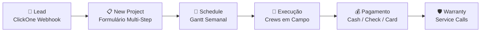

---
tags:
  - moc
  - siding-depot
  - home
aliases:
  - Siding Depot
  - Home
created: 2026-04-17
---

# 🏗️ Siding Depot — Plataforma Completa

> **Versão:** Abril 2026
> **Stack:** Next.js 14 (App Router) · React 18 · TypeScript · Supabase · Tailwind CSS
> **Hospedagem:** Vercel
> **Domínio:** siding-depot.vercel.app

---

## 🗺️ Map of Content

> **💡 Novo Índice Estruturado:** Consulte o **[[Siding Depot — Índice]]** para ver a nova arquitetura dividida por Regras de Negócio, Domínio, e UI/UX.

### Core

| Módulo | Descrição |
|--------|-----------|
| [[Arquitetura Técnica]] | Stack, estrutura de diretórios, diagrama de sistema |
| [[Autenticação e Controle de Acesso]] | Login, RBAC, roles, fluxo de autenticação |
| [[Design System]] | Paleta de cores, tipografia, componentes compartilhados |
| [[Banco de Dados]] | Schema Supabase completo com diagrama ER |

### Operacional

| Módulo | Descrição |
|--------|-----------|
| [[Dashboard]] | Home com KPIs globais e projetos recentes |
| [[Projects]] | Gestão completa de projetos com inline edit |
| [[New Project]] | Formulário multi-step de criação de projeto |
| [[Crews e Partners]] | Diretório de equipes com capacidade e especialidades |
| [[Job Schedule]] | Calendário Gantt semanal com drag & drop |

### Financeiro

| Módulo | Descrição |
|--------|-----------|
| [[Change Orders]] | Ordens de alteração com pipeline de aprovação |
| [[Cash Payments]] | Controle de pagamentos em dinheiro |
| [[Sales Reports]] | Metas, snapshots, leaderboard de vendas |

### Serviços & Tracking

| Módulo | Descrição |
|--------|-----------|
| [[Windows e Doors Tracker]] | Rastreamento de pedidos de janelas e portas |
| [[Services e Warranty]] | Chamados de serviço e garantia |

### Configuração & Integrações

| Módulo | Descrição |
|--------|-----------|
| [[Settings]] | Perfil, organização, users & permissions |
| [[Notificações em Tempo Real]] | Sistema Realtime com Supabase |
| [[Webhook ClickOne]] | Integração com CRM externo |

### Portais Externos

| Módulo | Descrição |
|--------|-----------|
| [[Customer Portal]] | Portal read-only para clientes |
| [[Field App]] | App de campo para crews |
| [[Documentos e Contratos Digitais]] | Assinatura digital de certificados |

---

## 👥 Público-alvo

| Papel | Acesso | Módulos |
|-------|--------|---------|
| **Admin** | Total | Todos |
| **Salesperson** | Parcial | [[Dashboard]], [[Projects]], [[Sales Reports]], [[Job Schedule]] |
| **Partner / Crew** | Campo | [[Field App]], Jobs atribuídos |
| **Customer** | Portal | [[Customer Portal]] (read-only) |

---

## 🔄 Ciclo de Vida do Projeto

```
Lead → Venda → Scheduling → Execução → Pagamento → Warranty
```



---

> [!NOTE]
> Esta documentação reflete o estado do sistema em **Abril 2026**.
> Código-fonte: `c:\Users\wylla\.gemini\Siding Depot\web\`
