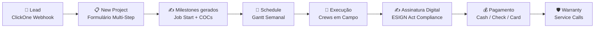

---
tags:
  - moc
  - siding-depot
  - home
aliases:
  - Siding Depot
  - Home
created: 2026-04-17
---

# 🏗️ Siding Depot — Plataforma Completa

> **Versão:** Abril 2026
> **Stack:** Next.js 14 (App Router) · React 18 · TypeScript · Supabase · Tailwind CSS
> **Hospedagem:** Vercel
> **Domínio:** siding-depot.vercel.app

---

## 🗺️ Map of Content

> **💡 Novo Índice Estruturado:** Consulte o **[[Siding Depot — Índice]]** para ver a nova arquitetura dividida por Regras de Negócio, Domínio, e UI/UX.

### Core

| Módulo | Descrição |
|--------|-----------|
| [[Arquitetura Técnica]] | Stack, estrutura de diretórios, diagrama de sistema |
| [[Autenticação e Controle de Acesso]] | Login, RBAC, roles, fluxo de autenticação |
| [[Design System]] | Paleta de cores, tipografia, componentes compartilhados |
| [[Banco de Dados]] | Schema Supabase completo com diagrama ER |

### Operacional

| Módulo | Descrição |
|--------|-----------|
| [[Dashboard]] | Home com KPIs globais e projetos recentes |
| [[Projects]] | Gestão completa de projetos com inline edit |
| [[New Project]] | Formulário multi-step de criação de projeto |
| [[Crews e Partners]] | Diretório de equipes com capacidade e especialidades |
| [[Job Schedule]] | Calendário Gantt semanal com drag & drop |

### Financeiro

| Módulo | Descrição |
|--------|-----------|
| [[Change Orders]] | Ordens de alteração com pipeline de aprovação |
| [[Cash Payments]] | Controle de pagamentos em dinheiro |
| [[Sales Reports]] | Metas, snapshots, leaderboard de vendas |

### Serviços & Tracking

| Módulo | Descrição |
|--------|-----------|
| [[Windows e Doors Tracker]] | Rastreamento de pedidos de janelas e portas |
| [[Services e Warranty]] | Chamados de serviço e garantia |

### Configuração & Integrações

| Módulo | Descrição |
|--------|-----------|
| [[Settings]] | Perfil, organização, users & permissions |
| [[Notificações em Tempo Real]] | Sistema Realtime com Supabase |
| [[Webhook ClickOne]] | Integração com CRM externo |

### Portais Externos

| Módulo | Descrição |
|--------|-----------|
| [[Customer Portal]] | Portal read-only para clientes |
| [[Field App]] | App de campo para crews |
| [[Documentos e Contratos Digitais]] | Assinatura digital de certificados |
| [[Assinatura Digital e Compliance]] | ESIGN Act, Georgia UETA, auditoria jurídica |

---

## 👥 Público-alvo

| Papel | Acesso | Módulos |
|-------|--------|---------|
| **Admin** | Total | Todos |
| **Salesperson** | Parcial | [[Dashboard]], [[Projects]], [[Sales Reports]], [[Job Schedule]] |
| **Partner / Crew** | Campo | [[Field App]], Jobs atribuídos |
| **Customer** | Portal | [[Customer Portal]] (read-only) |

---

## 🔄 Ciclo de Vida do Projeto

```
Lead → Venda → Scheduling → Execução → Assinatura → Pagamento → Warranty
```



---

## 📝 Changelog

### 2026-04-18 — Assinatura Digital e Documentos

| Feature | Descrição | Arquivos |
|---------|-----------|----------|
| **Auto-geração de milestones** | Job Start + 1 COC por serviço criados automaticamente | `new-project/page.tsx` |
| **Audit trail (ESIGN Act)** | IP, User-Agent, Geolocation, SHA-256 hash, consent | `/api/documents/sign/route.ts` |
| **Consent legal obrigatório** | Checkbox ESIGN Act + Georgia UETA no formulário | `DynamicContractForm.tsx` |
| **Admin Send to Client** | Botão na tab Documents para mudar `draft → pending_signature` | `projects/[id]/page.tsx` |
| **Admin Copy Link** | Copia URL de assinatura para enviar ao cliente | `projects/[id]/page.tsx` |
| **Notificação de assinatura** | Admin recebe notificação quando cliente assina | `/api/documents/sign/route.ts` |
| **Geração de PDF** | PDF profissional com audit trail via React-PDF | `lib/pdf/signed-document.tsx` |
| **Email com PDF** | Envio automático de cópia assinada via Resend | `lib/email/send-signed-document.ts` |
| **RLS Policies** | Customer SELECT + UPDATE, Admin ALL, Staff SELECT | Supabase DB |
| **Página de assinatura (Customer)** | `/customer/documents/[milestoneId]` | `customer/documents/[milestoneId]/page.tsx` |

→ Detalhes legais: [[Assinatura Digital e Compliance]]
→ Detalhes técnicos: [[Documentos e Contratos Digitais]]
→ Notificações: [[Notificações em Tempo Real]]

### 2026-04-19 — Customer Portal via New Project + Email Fix

| Feature | Descrição | Arquivos |
|---------|-----------|----------|
| **Portal via New Project** | Criação automática de auth user + profile ao criar projeto manual | `new-project/page.tsx` |
| **API Create Portal** | Nova rota server-side para criação de credenciais | `api/customers/create-portal/route.ts` |
| **Proteção contra duplicação** | Webhook e API verificam `profile_id` antes de criar | `webhook/clickone/route.ts`, `create-portal/route.ts` |
| **Resend sender fix** | Corrigido remetente de email para `onboarding@resend.dev` (free tier) | Todos os arquivos com Resend |
| **RESEND_FROM env var** | Override opcional para domínio verificado | `.env.local` |
| **Weather default** | Cidade padrão do clima alterada para Marietta, GA | `WeeklyWeather.tsx` |

→ Credenciais: [[Credenciais Customer Portal]]
→ Portal: [[Customer Portal]]
→ Auth: [[Autenticação e Controle de Acesso]]

---

> [!NOTE]
> Esta documentação reflete o estado do sistema em **Abril 2026**.
> Código-fonte: `c:\Users\wylla\.gemini\Siding Depot\web\`

