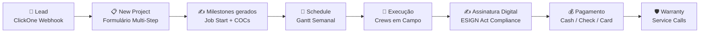

---
tags:
  - moc
  - siding-depot
  - home
aliases:
  - Siding Depot
  - Home
created: 2026-04-17
---

# 🏗️ Siding Depot — Plataforma Completa

> **Versão:** Abril 2026
> **Stack:** Next.js 14 (App Router) · React 18 · TypeScript · Supabase · Tailwind CSS
> **Hospedagem:** Vercel
> **Domínio:** siding-depot.vercel.app

---

## 🗺️ Map of Content

> **💡 Novo Índice Estruturado:** Consulte o **[[Siding Depot — Índice]]** para ver a nova arquitetura dividida por Regras de Negócio, Domínio, e UI/UX.

### Core

| Módulo | Descrição |
|--------|-----------|
| [[Arquitetura Técnica]] | Stack, estrutura de diretórios, diagrama de sistema |
| [[Autenticação e Controle de Acesso]] | Login, RBAC, roles, fluxo de autenticação |
| [[Design System]] | Paleta de cores, tipografia, componentes compartilhados |
| [[Banco de Dados]] | Schema Supabase completo com diagrama ER |

### Operacional

| Módulo | Descrição |
|--------|-----------|
| [[Dashboard]] | Home com KPIs globais e projetos recentes |
| [[Projects]] | Gestão completa de projetos com inline edit |
| [[New Project]] | Formulário multi-step de criação de projeto |
| [[Crews e Partners]] | Diretório de equipes com capacidade e especialidades |
| [[Job Schedule]] | Calendário Gantt semanal com drag & drop |
| [[Calculador de Duração por Parceiro]] | Tabelas de SQ/dia por parceiro para cálculo automático de `durationDays` |

### Financeiro

| Módulo | Descrição |
|--------|-----------|
| [[Change Orders]] | Ordens de alteração com pipeline de aprovação |
| [[Cash Payments]] | Controle de pagamentos em dinheiro |
| [[Sales Reports]] | Metas, snapshots, leaderboard de vendas |

### Serviços & Tracking

| Módulo | Descrição |
|--------|-----------|
| [[Windows e Doors Tracker]] | Rastreamento de pedidos de janelas e portas |
| [[Services e Warranty]] | Chamados de serviço e garantia |

### Configuração & Integrações

| Módulo | Descrição |
|--------|-----------|
| [[Settings]] | Perfil, organização, users & permissions |
| [[Notificações em Tempo Real]] | Sistema Realtime com Supabase |
| [[Webhook ClickOne]] | Integração com CRM externo |

### Portais Externos

| Módulo | Descrição |
|--------|-----------|
| [[Customer Portal]] | Portal read-only para clientes |
| [[Field App]] | App de campo para crews |
| [[Documentos e Contratos Digitais]] | Assinatura digital de certificados |
| [[Assinatura Digital e Compliance]] | ESIGN Act, Georgia UETA, auditoria jurídica |

---

## 👥 Público-alvo

| Papel | Acesso | Módulos |
|-------|--------|---------|
| **Admin** | Total | Todos |
| **Salesperson** | Parcial | [[Dashboard]], [[Projects]], [[Sales Reports]], [[Job Schedule]] |
| **Partner / Crew** | Campo | [[Field App]], Jobs atribuídos |
| **Customer** | Portal | [[Customer Portal]] (read-only) |

---

## 🔄 Ciclo de Vida do Projeto

```
Lead → Venda → Scheduling → Execução → Assinatura → Pagamento → Warranty
```



---

## 📝 Changelog

### 2026-04-18 — Assinatura Digital e Documentos

| Feature | Descrição | Arquivos |
|---------|-----------|----------|
| **Auto-geração de milestones** | Job Start + 1 COC por serviço criados automaticamente | `new-project/page.tsx` |
| **Audit trail (ESIGN Act)** | IP, User-Agent, Geolocation, SHA-256 hash, consent | `/api/documents/sign/route.ts` |
| **Consent legal obrigatório** | Checkbox ESIGN Act + Georgia UETA no formulário | `DynamicContractForm.tsx` |
| **Admin Send to Client** | Botão na tab Documents para mudar `draft → pending_signature` | `projects/[id]/page.tsx` |
| **Admin Copy Link** | Copia URL de assinatura para enviar ao cliente | `projects/[id]/page.tsx` |
| **Notificação de assinatura** | Admin recebe notificação quando cliente assina | `/api/documents/sign/route.ts` |
| **Geração de PDF** | PDF profissional com audit trail via React-PDF | `lib/pdf/signed-document.tsx` |
| **Email com PDF** | Envio automático de cópia assinada via Resend | `lib/email/send-signed-document.ts` |
| **RLS Policies** | Customer SELECT + UPDATE, Admin ALL, Staff SELECT | Supabase DB |
| **Página de assinatura (Customer)** | `/customer/documents/[milestoneId]` | `customer/documents/[milestoneId]/page.tsx` |

→ Detalhes legais: [[Assinatura Digital e Compliance]]
→ Detalhes técnicos: [[Documentos e Contratos Digitais]]
→ Notificações: [[Notificações em Tempo Real]]

### 2026-04-19 — Customer Portal via New Project + Email Fix

| Feature | Descrição | Arquivos |
|---------|-----------|----------|
| **Portal via New Project** | Criação automática de auth user + profile ao criar projeto manual | `new-project/page.tsx` |
| **API Create Portal** | Nova rota server-side para criação de credenciais | `api/customers/create-portal/route.ts` |
| **Proteção contra duplicação** | Webhook e API verificam `profile_id` antes de criar | `webhook/clickone/route.ts`, `create-portal/route.ts` |
| **Resend sender fix** | Corrigido remetente de email para `onboarding@resend.dev` (free tier) | Todos os arquivos com Resend |
| **RESEND_FROM env var** | Override opcional para domínio verificado | `.env.local` |
| **Weather default** | Cidade padrão do clima alterada para Marietta, GA | `WeeklyWeather.tsx` |

→ Credenciais: [[Credenciais Customer Portal]]
→ Portal: [[Customer Portal]]
→ Auth: [[Autenticação e Controle de Acesso]]

### 2026-04-19 — Gmail SMTP, Compressão de Imagens e Storage Cleanup

| Feature | Descrição | Arquivos |
|---------|-----------|----------|
| **Gmail SMTP** | Migrado de Resend para Nodemailer + Gmail App Password | `webhook/clickone/route.ts` |
| **Compressão de imagens** | Reduz ~80% do tamanho antes de upload (1920px + 82% JPEG) | `lib/compressImage.ts` |
| **5 pontos de upload atualizados** | Services edit, New Service Call, Change Orders (admin + field) | Múltiplos |
| **Storage cleanup on delete** | Ao deletar projeto, limpa fotos/vídeos/docs do Storage | `projects/page.tsx` |
| **Serviço "Doors" adicionado** | Novo tipo de serviço no banco e mapeamento do webhook | `service_types` table |
| **Sales Reports: Client + Service** | Nome do cliente e badges de serviço na tabela do accordion | `sales-reports/page.tsx` |
| **Alias mapping de vendedores** | Normaliza nomes do CRM ClickOne para nomes internos | `webhook/clickone/route.ts` |
| **customData extraction** | Extrai campos personalizados do payload do webhook | `webhook/clickone/route.ts` |
| **Teste de email endpoint** | Rota `/api/test-email` para validar Gmail SMTP | `api/test-email/route.ts` |

→ Webhook: [[Webhook ClickOne]]
→ Serviços: [[Services e Warranty]]
→ Vendas: [[Sales Reports]]
→ Credenciais: [[Credenciais Customer Portal]]

### 2026-04-21 — Calculador de Duração por Parceiro + Melhorias de UI

| Feature | Descrição | Arquivos |
|---------|-----------|----------|
| **Calculador de Duração** | Substituiu fórmulas genéricas por tabelas específicas de cada parceiro (XICARA, WILMAR, SULA, LUÍS para Siding; OSVIN, VICTOR, JUAN para Painting) | `lib/duration-calculator.ts` |
| **Integração no Schedule** | Modal de rescheduling recalcula `durationDays` automaticamente ao alterar SQ, usando a tabela do parceiro atribuído | `schedule/page.tsx` |
| **Integração em New Project** | Criação de projeto usa o parceiro selecionado no formulário para calcular datas de fim precisas | `new-project/page.tsx` |
| **Integração em Project Detail** | Adição de serviços a projeto existente calcula duração pelo crew padrão de cada serviço | `projects/[id]/page.tsx` |
| **Sábado como dia útil** | Confirmado que Sábado é dia de trabalho — apenas Domingo pula | Todos os cálculos de cascata |
| **Project Preview (Satellite)** | Card lateral usa Google Maps Satellite Embed para mostrar vista aérea real do endereço | `new-project/page.tsx` |
| **Cards 100% largura** | Detalhes do projeto removeram `max-w-4xl` para cards de ponta a ponta | `projects/[id]/page.tsx` |
| **DWD Card color fix** | Cards de Doors/Windows/Decks inativos corrigidos para fundo branco (mesmo estilo dos demais) | `projects/[id]/page.tsx` |

→ Calculador: [[Calculador de Duração por Parceiro]]
→ Schedule: [[Job Schedule]]

### 2026-04-22 — Atribuição Manual, Pending Status, Close Date, Material Extra

| Feature | Descrição | Arquivos |
|---------|-----------|----------|
| **Atribuição Manual de Parceiros** | Webhook não atribui mais crews automaticamente — admin faz manualmente | `webhook/clickone/route.ts`, `projects/[id]/page.tsx`, `crews/page.tsx` |
| **Close Date → Sold Date** | `Close_date` do ClickOne agora popula `contract_signed_at` automaticamente | `webhook/clickone/route.ts` |
| **Tentative → Pending (vermelho)** | Status renomeado e cor alterada de amarelo para vermelho | `schedule/page.tsx`, `projects/page.tsx` |
| **Webhook Status = Pending** | Jobs do webhook entram com status `pending` (antes `draft`) | `webhook/clickone/route.ts` |
| **Solicitação de Material Extra** | Parceiros solicitam material pelo portal com nome, quantidade, tamanho e nota | `field/jobs/page.tsx`, `projects/[id]/page.tsx` |
| **Portal Parceiro — My Jobs real** | Dados reais do banco via RLS (não mais fictício) | `field/jobs/page.tsx` |
| **Month Picker fix** | Corrigido bug que selecionava o mês errado no calendário | `schedule/page.tsx` |
| **Pause: Scheduling** | Flag global `SCHEDULING_PAUSED` impede criação automática de agendamentos | `lib/scheduling-flag.ts` |
| **Pause: Welcome Email** | Flag `CUSTOMER_PORTAL_EMAIL_PAUSED` impede envio de email de boas-vindas | `webhook/clickone/route.ts` |

→ Detalhes: [[Changelog 2026-04-22]]
→ Webhook: [[Webhook ClickOne]]
→ Schedule: [[Job Schedule]]
→ Portal: [[Field App]]

### 2026-04-23 — Sincronização Global de Status e Dropdowns

| Feature | Descrição | Arquivos |
|---------|-----------|----------|
| **Status Literal no Banco** | `status` da tabela `jobs` aceita `pending`, `tentative`, `scheduled`, `in_progress`, `done` | Supabase DB |
| **Unificação Visual e Backend** | Remoção do mapeamento de data/fallback que causava conflito com `draft` e `active` | `projects/page.tsx`, `projects/[id]/page.tsx` |
| **Dropdown de Change Orders** | Corrigido para buscar os novos status em vez de buscar os extintos, resolvendo `No results found` | `change-orders/page.tsx` |
| **Filtros Globais** | Filtros de Crews e Vendas foram atualizados para consultar o banco usando os novos status literais | `crews/page.tsx`, `sales-reports/page.tsx` |
| **Modal do Calendário** | O salvamento do status e a renderização (In Progress / Done) obedecem o novo formato nativo | `schedule/page.tsx` |

→ Detalhes: [[Changelog 2026-04-23]]
→ Projetos: [[Projects]]
→ Schedule: [[Job Schedule]]

---

> [!NOTE]
> Esta documentação reflete o estado do sistema em **Abril 2026**.
> Código-fonte: `c:\Users\wylla\.gemini\Siding Depot\web\`

